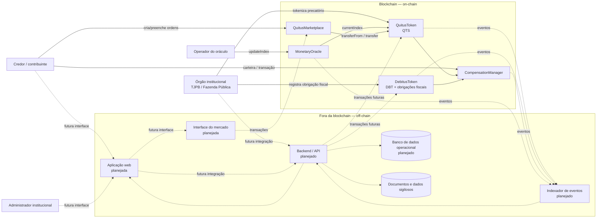

# Diagrama de arquitetura

## Visão geral

## O que fica on-chain

- Hash do identificador institucional do precatório, do crédito fiscal e da obrigação fiscal;
- Endereço do titular, beneficiário ou devedor associado ao registro;
- Valor tokenizado e valores da obrigação fiscal em unidades inteiras de centavo;
- Saldos e oferta total de QTS e DBT;
- Índice monetário atual publicado pelo `MonetaryOracle`;
- Último índice aplicado a cada conta QTS;
- Registro único das compensações executadas;
- Eventos de emissão, atualização monetária, transferência, queima, registro fiscal e compensação;
- Ordens de compra e venda do mercado secundário, valores remanescentes e eventos de negociação.

## O que fica off-chain

- PDFs e documentos judiciais completos;
- CPF, dados bancários e demais dados pessoais;
- Informações processuais sigilosas;
- Evidências e documentos usados pela instituição para autorizar a emissão;
- Banco operacional, autenticação, interface e indexação dos eventos;
- Fonte institucional real do índice monetário;
- Interface de usuário e indexação amigável do histórico de mercado.

## Justificativas preliminares

1. **Privacidade:** a blockchain armazena hashes e valores mínimos, e não documentos nem dados pessoais completos.
2. **Auditabilidade:** emissões, transferências, queimas e compensações ficam registradas como transações e eventos.
3. **Atomicidade:** a compensação queima QTS, materializa e queima DBT e reduz a obrigação fiscal na mesma transação. Se uma etapa falhar, nenhuma alteração permanece.
4. **Atualização monetária:** `MonetaryOracle` publica um índice cumulativo e `QuitusToken` o utiliza para materializar correções de forma lazy.
5. **Integração institucional:** backend, autenticação e integrações reais com TJPB/Fazenda ainda são componentes planejados.
6. **Mercado secundário:** `QuitusMarketplace` mantém ofertas on-chain e usa ETH de teste apenas como mecanismo técnico de liquidação.
7. **Evolução:** indexador, backend e aplicação web continuam planejados e só devem ser considerados implementados quando existirem no código.

## Estado atual

Já existem on-chain `MonetaryOracle`, `QuitusToken`, `DebitusToken` e `CompensationManager`.

`CompensationManager.compensate(referenceId, fiscalDebtIdHash, amount)` já consome `FiscalDebt.remainingAmount`. O solicitante não mantém DBT previamente: `DebitusToken` emite e queima o DBT correspondente dentro da própria compensação.

`QuitusMarketplace` já implementa ordens de compra e venda, execução parcial/total e cancelamento. Indexador, backend e aplicação web ainda não estão implementados.
