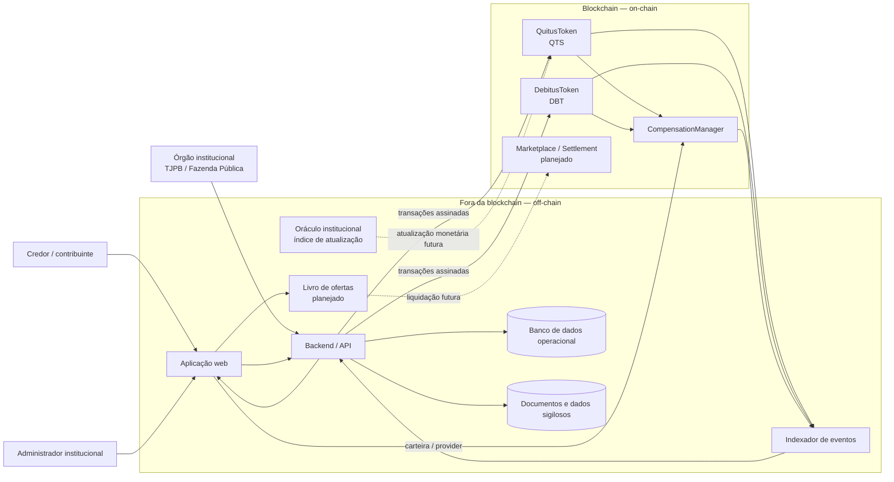

# Diagrama preliminar de arquitetura

## Visão geral

## O que fica on-chain

- Hash do identificador institucional do precatório e do crédito fiscal;
- Endereço do titular ou beneficiário;
- Valor tokenizado em unidades inteiras de centavo;
- Saldos e oferta total de QTS e DBT;
- Registro único das compensações;
- Eventos de emissão, transferência, queima e compensação;
- Futuramente, índice de atualização utilizado e liquidação das operações de mercado.

## O que fica off-chain

- PDFs e documentos judiciais completos;
- CPF, dados bancários e demais dados pessoais;
- Informações processuais sigilosas;
- Evidências e documentos usados pela instituição para autorizar a emissão;
- Banco operacional, autenticação, interface e indexação dos eventos;
- Livro de ofertas do mercado secundário, mantendo apenas a liquidação final na blockchain.

## Justificativas preliminares

1. **Privacidade:** a blockchain armazena hashes e valores mínimos, e não documentos nem dados pessoais completos.
2. **Auditabilidade:** emissões, transferências, queimas e compensações ficam registradas como transações e eventos.
3. **Atomicidade:** a compensação queima QTS e DBT na mesma transação. Se uma etapa falhar, nenhuma alteração permanece.
4. **Integração institucional:** o backend representa a camada de integração com sistemas do TJPB e da Fazenda Pública.
5. **Evolução:** oráculo de atualização monetária e mercado secundário aparecem como componentes planejados para as próximas entregas.

## Escopo desta entrega vs. diagrama completo

O diagrama mostra a solução **planejada**. Nesta entrega, o que já existe on-chain é só `QuitusToken`, `DebitusToken` e `CompensationManager` (emissão + compensação). Oráculo, marketplace, indexador e aplicação web aparecem como componentes futuros — e devem evoluir nas próximas entregas.
