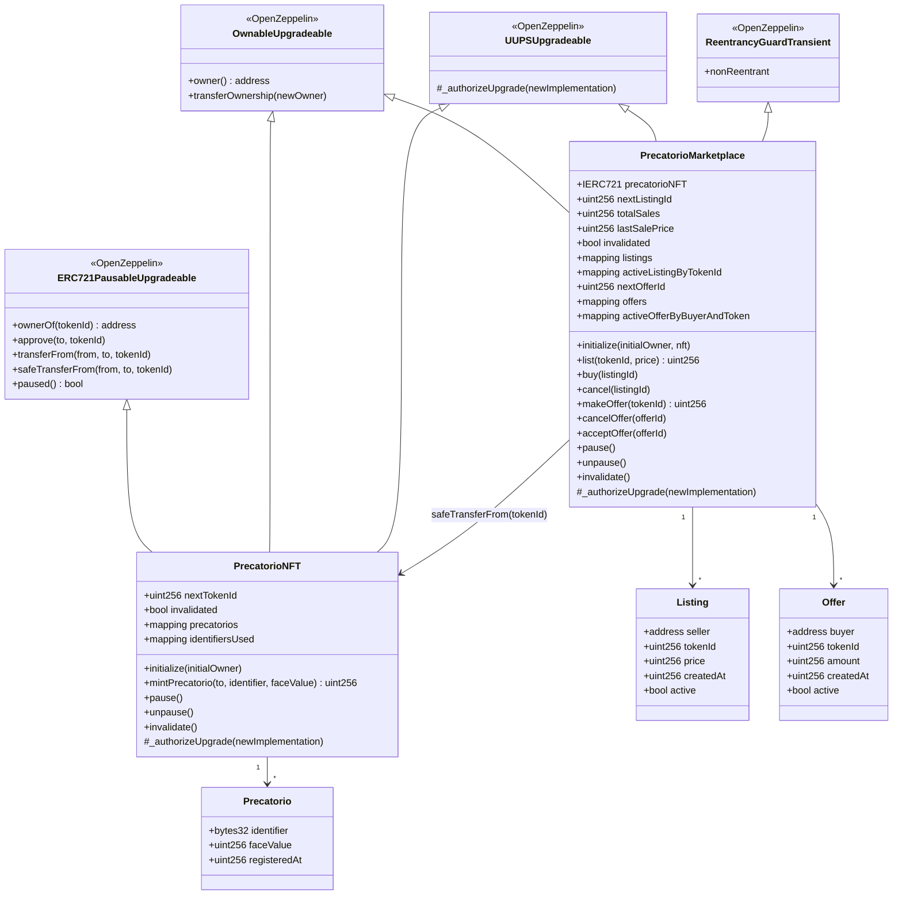

# Diagrama de classes dos contratos

O diagrama abaixo representa somente os contratos da arquitetura atual.



## `PrecatorioNFT`

Cada `tokenId` identifica um precatório individual.

```solidity
struct Precatorio {
    bytes32 identifier;
    uint256 faceValue;
    uint256 registeredAt;
}
```

`mintPrecatorio` aceita somente dados mínimos para a demonstração. O identificador textual informado no frontend é convertido em `bytes32` antes da transação.

A herança de `ERC721PausableUpgradeable` fornece o comportamento ERC-721 e bloqueio de transferências durante pausa. `OwnableUpgradeable` controla as operações institucionais e `UUPSUpgradeable` permite atualização da implementação.

## `PrecatorioMarketplace`

```solidity
struct Listing {
    address seller;
    uint256 tokenId;
    uint256 price;
    uint256 createdAt;
    bool active;
}
```

A listagem não guarda quantidade porque um ERC-721 é individual. O vendedor mantém o NFT na própria carteira até a compra e precisa aprovar previamente o marketplace.

Na compra:

1. a listagem é validada;
2. o estado é marcado como encerrado;
3. o NFT é transferido para o comprador;
4. o ETH de teste é enviado ao vendedor;
5. o evento de venda é emitido.

Se qualquer chamada reverter, a transação inteira é revertida pela EVM. `buy` também usa `ReentrancyGuardTransient` da OpenZeppelin; como a PoC já compila para Cancun, o guard utiliza armazenamento transitório (EIP-1153) sem adicionar estado persistente ao layout do proxy.

### Lado da demanda — `Offer`

```solidity
struct Offer {
    address buyer;
    uint256 tokenId;
    uint256 amount;
    uint256 createdAt;
    bool active;
}
```

`makeOffer` não exige listagem prévia: qualquer conta que não seja a proprietária atual do `tokenId` pode escrowar ETH de teste como lance. `acceptOffer` só pode ser chamado pelo proprietário atual (que precisa ter aprovado o marketplace, igual a `buy`) e, na mesma transação, encerra uma listagem a preço fixo eventualmente ativa para o mesmo `tokenId`. Se o comprador tiver recebido o NFT por outro fluxo enquanto a oferta ainda estiver ativa, o autoaceite é bloqueado para não registrar uma venda artificial; ele continua podendo usar `cancelOffer` para recuperar o depósito. `cancelOffer` devolve o depósito ao comprador e, deliberadamente, não usa `whenValid`/`whenNotPaused`: como o ETH fica dentro do contrato, o comprador precisa sempre conseguir recuperá-lo.

## Estados administrativos

Os dois contratos implementam:

```text
ATIVO
  ├─ pause() ──> PAUSADO
  │                 └─ unpause() ──> ATIVO
  ├─ upgrade ──> nova implementação / mesmo proxy
  └─ invalidate() ──> INVALIDADO
                         └─ terminal
```

Depois da invalidação, `_authorizeUpgrade` também rejeita novas atualizações. `renounceOwnership()` é desabilitado nos dois contratos para preservar a capacidade administrativa necessária a pausa, upgrade e invalidação.

Única exceção deliberada: `cancelOffer` continua funcionando mesmo com `PrecatorioMarketplace` pausado ou invalidado, porque é a única função mutável do contrato que devolve um saldo que já pertence ao chamador (o ETH escrowado do próprio lance), em vez de operar um estado de domínio.

## Organização dos arquivos Solidity

A implementação de produção possui somente dois contratos próprios porque existem somente duas responsabilidades on-chain independentes: representar o ativo e negociá-lo. A árvore deliberadamente evita interfaces, bibliotecas e contratos-base locais sem reutilização real:

```text
blockchain/contracts/
├── PrecatorioNFT.sol
├── PrecatorioMarketplace.sol
└── mocks/
    ├── PrecatorioNFTV2.sol
    └── PrecatorioMarketplaceV2.sol
```

Cada contrato principal ocupa um arquivo com o mesmo nome, alinhado ao Style Guide do Solidity. Comportamentos padronizados (ERC-721, propriedade, pausa, UUPS, `IERC721` e proteção contra reentrância) são importados da OpenZeppelin em vez de reimplementados em arquivos locais. Os contratos `V2` ficam isolados em `mocks/` porque existem apenas para validar a demonstração de upgrade.

Não há uma pasta `interfaces/` própria porque `PrecatorioMarketplace` depende somente da interface padronizada `IERC721`. Também não há contrato-base comum de ciclo de vida: com apenas dois contratos, extrair `pause`/`invalidate` para uma nova hierarquia aumentaria a complexidade de herança e de layout de storage de uma arquitetura upgradeable sem ganho relevante de reutilização. Se novas implementações passarem a compartilhar esse comportamento, essa decisão pode ser revista preservando as regras de compatibilidade de storage.

Referências:

- [Solidity — Style Guide](https://docs.soliditylang.org/en/latest/style-guide.html)
- [Solidity — Structure of a Contract](https://docs.soliditylang.org/en/latest/structure-of-a-contract.html)
- [OpenZeppelin Contracts](https://docs.openzeppelin.com/contracts/5.x)
- [OpenZeppelin — Writing Upgradeable Contracts](https://docs.openzeppelin.com/upgrades-plugins/writing-upgradeable)
- [OpenZeppelin — ReentrancyGuardTransient](https://github.com/OpenZeppelin/openzeppelin-contracts/blob/v5.6.1/contracts/utils/ReentrancyGuardTransient.sol)
