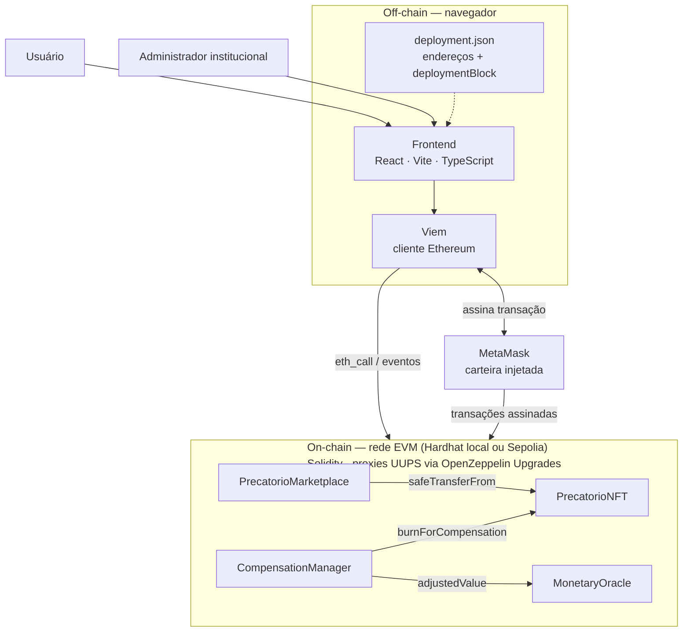

# Arquitetura do sistema

Este diagrama representa os componentes da implementação atual da PoC, a tecnologia de cada camada e a fronteira entre off-chain e on-chain. Ele **não** enumera cada função chamada por cada perfil de usuário — isso é responsabilidade dos diagramas de sequência em [`fluxos/`](../fluxos/); aqui o objetivo é mostrar quem fala com quem e com qual tecnologia, sem repetir a mesma seta uma vez por contrato.



Cada camada e sua tecnologia:

| Camada | Tecnologia |
| --- | --- |
| Interface | React + Vite + TypeScript |
| Cliente Ethereum | [Viem](https://viem.sh) — leitura por `eth_call`/eventos, escrita por transação assinada |
| Carteira | MetaMask (ou outra carteira injetada compatível com EIP-1193) |
| Contratos | Solidity 0.8.24, atrás de proxies UUPS (`@openzeppelin/hardhat-upgrades`) |
| Rede | Hardhat local (desenvolvimento) ou Sepolia (rede de testes pública) |

O frontend não distingue Hardhat local de Sepolia em código: ambas são redes EVM compatíveis, e o `chainId` gravado em `deployment.json` decide qual RPC/chain a Viem usa (`frontend/src/blockchain/client.ts`).

## On-chain

### `PrecatorioNFT`

Responsável por:

- representar cada precatório como um ERC-721 individual;
- registrar identificador abstrato, valor de face e instante de registro;
- controlar propriedade, aprovações e transferências;
- restringir mint ao administrador;
- autorizar um único `CompensationManager` a queimar precatórios compensados (`burnForCompensation`);
- permitir pausa temporária;
- permitir upgrade UUPS enquanto válido;
- permitir invalidação permanente.

### `PrecatorioMarketplace`

Responsável por:

- registrar listagens de um `tokenId` completo (lado da oferta);
- receber e escrever em custódia ofertas/lances de compra em ETH (lado da demanda);
- armazenar preço, vendedor e comprador conforme o caso;
- executar compra por listagem (`buy`) ou por aceite de oferta (`acceptOffer`) com ETH de teste;
- transferir o NFT ao comprador em ambos os fluxos;
- cancelar listagens e ofertas, devolvendo o ETH em custódia ao caso de cancelamento de oferta;
- registrar estatísticas básicas de vendas, listagens e ofertas;
- oferecer pausa, upgrade e invalidação com as mesmas regras administrativas — exceto `cancelOffer`, que permanece disponível mesmo pausado/invalidado para não prender fundos de terceiros.

### `MonetaryOracle`

Responsável por:

- publicar um índice acumulado de correção monetária mock, com precisão `1e18` (fator neutro `1,0`);
- expor `adjustedValue(faceValue)`, consultável mesmo pausado, para calcular o valor de face corrigido;
- impedir regressão do índice publicado (correção acumulada não regride);
- permitir pausa temporária, upgrade UUPS e invalidação permanente com as mesmas regras dos demais contratos.

### `CompensationManager`

Responsável por:

- registrar débitos fiscais mock (papel da Fazenda, restrito ao administrador);
- executar `compensate(tokenId, debtId)` em uma única transação indivisível: consulta o crédito corrigido no `MonetaryOracle`, abate o débito e queima o NFT via `PrecatorioNFT.burnForCompensation`;
- manter um registro permanente e consultável de cada compensação executada (termo de quitação);
- permitir pausa temporária, upgrade UUPS e invalidação permanente com as mesmas regras dos demais contratos.

Detalhamento completo dos quatro contratos (estruturas, funções e relações) em [`arquitetura/contratos.md`](./contratos.md).

## Off-chain

Permanecem fora da blockchain:

- documentos judiciais completos;
- validação jurídica do precatório;
- identidade civil e dados bancários;
- integração real com TJPB/Fazenda;
- fonte institucional real de correção monetária (SELIC/IPCA-E);
- liquidação financeira regulada;
- indexação de produção.

O frontend consulta eventos e estado dos contratos diretamente por JSON-RPC e solicita assinaturas pela carteira. `deployment.json` registra o bloco inicial da implantação para limitar a faixa de logs consultada — usado tanto para reconstituir precatórios/listagens/ofertas quanto débitos fiscais e compensações executadas. A PoC não possui servidor HTTP/API próprio.

## Upgrade e invalidação

Enquanto um proxy estiver válido:

```text
Proxy → Implementação V1
      → upgrade
Proxy → Implementação V2
```

O endereço do proxy permanece estável e o estado é preservado. Essa mecânica é idêntica para os quatro contratos — cada um por trás do próprio proxy UUPS, com a própria implementação.

Após `invalidate()`:

```text
ATIVO/PAUSADO → INVALIDADO
```

a transição é terminal. O contrato permanece consultável como registro histórico, mas operações mutáveis, `unpause` e novos upgrades são bloqueados.
