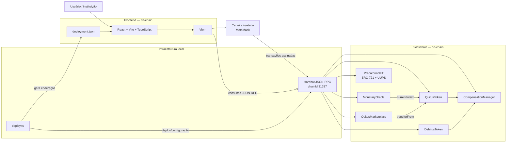

# Arquitetura do sistema

> **Revisão de escopo em andamento:** o primeiro diagrama representa o código que existe hoje. O segundo registra a arquitetura definida após o feedback do professor e será substituído pelo diagrama único definitivo conforme a implementação ERC-721 avançar.

## Estado atualmente implementado


A PoC atual é composta por duas partes executáveis: o **frontend React** e a **camada blockchain Hardhat/Solidity**. Não existe um servidor de aplicação próprio nesta versão.



## Organização do repositório

```text
Lab4/
├── blockchain/  # smart contracts, testes e deploy
├── frontend/    # aplicação React
└── docs/        # arquitetura, fluxos e operação
```

A pasta `blockchain/` substitui a ideia genérica de “backend”. Nesta PoC, não há API HTTP, banco de dados ou serviço de aplicação intermediário.

## O que fica on-chain

- hash do identificador institucional do precatório;
- hash da obrigação fiscal;
- endereços de beneficiários, devedores e participantes das ordens;
- saldos e oferta total de QTS/DBT;
- índice monetário atual e último índice aplicado às contas QTS;
- estado das obrigações fiscais;
- referências de compensação já utilizadas;
- ordens do mercado secundário;
- eventos de emissão, correção, transferência, compensação e negociação.

## O que permanece off-chain

- documentos judiciais completos;
- CPF, dados bancários e dados pessoais não necessários à execução dos contratos;
- validação jurídica de precatórios e obrigações fiscais;
- fonte institucional real do índice monetário;
- identidade e autorização institucional de produção;
- eventual indexação avançada, analytics e integração com sistemas do TJPB/Fazenda.

## Fluxo da interface

O frontend carrega os endereços de `frontend/public/deployment.json`, criado pelo script de deploy local. Leituras usam um `PublicClient` do Viem e transações usam uma carteira injetada.

Não são armazenadas chaves privadas no frontend nem no repositório.

## Justificativas

1. **Separação de responsabilidades:** Solidity concentra regras on-chain; React concentra interação e apresentação.
2. **Auditabilidade:** operações relevantes permanecem registradas como estado e eventos da blockchain.
3. **Atomicidade:** a compensação atualiza QTS, DBT e obrigação fiscal na mesma transação.
4. **Privacidade:** dados jurídicos completos não são publicados na blockchain.
5. **PoC enxuta:** um backend HTTP não foi criado porque não é necessário para demonstrar os fluxos exigidos.
6. **Evolução futura:** integrações institucionais, indexador e autenticação podem ser adicionados sem alterar a separação principal entre interface e contratos.

## Estado atual

Implementado:

- `MonetaryOracle`;
- `QuitusToken`;
- `DebitusToken`;
- `CompensationManager`;
- `QuitusMarketplace`;
- `PrecatorioNFT` ERC-721 compatível com proxy UUPS, com pausa e invalidação permanente (ainda não incluído no deploy/frontend atual);
- testes Hardhat;
- deploy local;
- frontend React conectado por Viem.

Não implementado:

- integração com sistemas institucionais reais;
- fonte oficial automática do índice;
- deploy permissionado de produção;
- indexador dedicado;
- autenticação/identidade institucional de produção.


## Arquitetura revisada

A próxima versão simplifica a camada on-chain e coloca a negociação de precatórios individualizados no centro da PoC.

```mermaid
flowchart LR
    U[Usuário]
    I[Operador institucional]
    W[Carteira injetada<br/>MetaMask]

    subgraph FE2["Frontend — off-chain"]
        UI2[React + Vite + TypeScript]
        VIEM2[Viem]
    end

    subgraph ON2["Blockchain — arquitetura revisada"]
        PROXYNFT[Proxy<br/>PrecatorioNFT<br/>válido ou invalidado]
        NFT[Implementação<br/>ERC-721 + UUPS]
        PROXYMKT[Proxy<br/>Marketplace]
        MKT2[Implementação<br/>NFT Marketplace]
    end

    U --> UI2
    I --> UI2
    UI2 --> VIEM2
    VIEM2 --> W

    W -->|mint autorizado / transferências| PROXYNFT
    W -->|listar / comprar / cancelar| PROXYMKT

    PROXYNFT -. delega lógica .-> NFT
    PROXYMKT -. delega lógica .-> MKT2
    MKT2 -->|transferFrom(tokenId)| PROXYNFT
```

### On-chain na arquitetura revisada

- propriedade dos NFTs de precatórios;
- metadados mínimos da PoC;
- aprovações e transferências ERC-721;
- listagens e preços do marketplace;
- compra e cancelamento;
- eventos;
- pausa de emergência temporária;
- upgrade UUPS enquanto o contrato permanecer válido;
- invalidação permanente, que bloqueia retomada e upgrades.

### Off-chain na arquitetura revisada

- documentos judiciais completos;
- validação da existência e legitimidade do precatório;
- identidade civil real;
- dados bancários e pessoais;
- integração com tribunais e órgãos públicos;
- liquidação financeira regulada de produção.

A revisão remove da arquitetura alvo a necessidade de modelar documentos completos, QTS/DBT fungíveis, oráculo monetário e compensação fiscal como partes centrais da demonstração.

A decisão completa está em [`../decisoes/revisao-escopo-nft.md`](../decisoes/revisao-escopo-nft.md).


### Estado terminal do proxy

O proxy upgradeável não implica que o contrato possa ser atualizado para sempre. `invalidate()` encerra permanentemente a capacidade operacional daquele proxy: as leituras históricas continuam acessíveis, mas mint, aprovações, transferências, `unpause` e upgrades ficam bloqueados.
