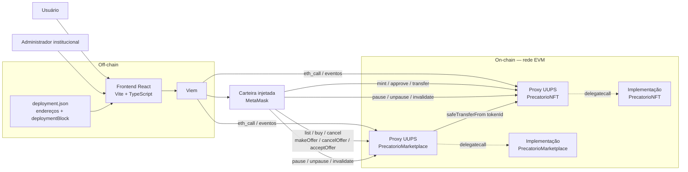

# Arquitetura do sistema

Este diagrama representa a implementação atual da PoC.



## On-chain

### `PrecatorioNFT`

Responsável por:

- representar cada precatório como um ERC-721 individual;
- registrar identificador abstrato, valor de face e instante de registro;
- controlar propriedade, aprovações e transferências;
- restringir mint ao administrador;
- permitir pausa temporária;
- permitir upgrade UUPS enquanto válido;
- permitir invalidação permanente.

### `PrecatorioMarketplace`

Responsável por:

- registrar listagens de um `tokenId` completo (lado da oferta);
- receber e escrever em custódia ofertas/lances de compra em ETH (lado da demanda);
- armazenar preço, vendedor e comprador conforme o caso;
- executar compra por listagem (`buy`) ou por aceite de oferta (`acceptOffer`) com ETH de teste;
- transferir o NFT ao comprador em ambos os fluxos;
- cancelar listagens e ofertas, devolvendo o ETH em custódia ao caso de cancelamento de oferta;
- registrar estatísticas básicas de vendas, listagens e ofertas;
- oferecer pausa, upgrade e invalidação com as mesmas regras administrativas — exceto `cancelOffer`, que permanece disponível mesmo pausado/invalidado para não prender fundos de terceiros.

## Off-chain

Permanecem fora da blockchain:

- documentos judiciais completos;
- validação jurídica do precatório;
- identidade civil e dados bancários;
- integração real com TJPB/Fazenda;
- liquidação financeira regulada;
- indexação de produção.

O frontend consulta eventos e estado dos contratos diretamente por JSON-RPC e solicita assinaturas pela carteira. `deployment.json` registra o bloco inicial da implantação para limitar a faixa de logs consultada. A PoC não possui servidor HTTP/API próprio.

## Upgrade e invalidação

Enquanto um proxy estiver válido:

```text
Proxy → Implementação V1
      → upgrade
Proxy → Implementação V2
```

O endereço do proxy permanece estável e o estado é preservado.

Após `invalidate()`:

```text
ATIVO/PAUSADO → INVALIDADO
```

a transição é terminal. O contrato permanece consultável como registro histórico, mas operações mutáveis, `unpause` e novos upgrades são bloqueados.
