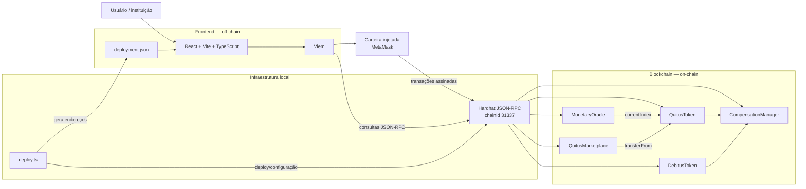

# Arquitetura do sistema

## Visão geral

A PoC atual é composta por duas partes executáveis: o **frontend React** e a **camada blockchain Hardhat/Solidity**. Não existe um servidor de aplicação próprio nesta versão.



## Organização do repositório

```text
Lab4/
├── blockchain/  # smart contracts, testes e deploy
├── frontend/    # aplicação React
└── docs/        # arquitetura, fluxos e operação
```

A pasta `blockchain/` substitui a ideia genérica de “backend”. Nesta PoC, não há API HTTP, banco de dados ou serviço de aplicação intermediário.

## O que fica on-chain

- hash do identificador institucional do precatório;
- hash da obrigação fiscal;
- endereços de beneficiários, devedores e participantes das ordens;
- saldos e oferta total de QTS/DBT;
- índice monetário atual e último índice aplicado às contas QTS;
- estado das obrigações fiscais;
- referências de compensação já utilizadas;
- ordens do mercado secundário;
- eventos de emissão, correção, transferência, compensação e negociação.

## O que permanece off-chain

- documentos judiciais completos;
- CPF, dados bancários e dados pessoais não necessários à execução dos contratos;
- validação jurídica de precatórios e obrigações fiscais;
- fonte institucional real do índice monetário;
- identidade e autorização institucional de produção;
- eventual indexação avançada, analytics e integração com sistemas do TJPB/Fazenda.

## Fluxo da interface

O frontend carrega os endereços de `frontend/public/deployment.json`, criado pelo script de deploy local. Leituras usam um `PublicClient` do Viem e transações usam uma carteira injetada.

Não são armazenadas chaves privadas no frontend nem no repositório.

## Justificativas

1. **Separação de responsabilidades:** Solidity concentra regras on-chain; React concentra interação e apresentação.
2. **Auditabilidade:** operações relevantes permanecem registradas como estado e eventos da blockchain.
3. **Atomicidade:** a compensação atualiza QTS, DBT e obrigação fiscal na mesma transação.
4. **Privacidade:** dados jurídicos completos não são publicados na blockchain.
5. **PoC enxuta:** um backend HTTP não foi criado porque não é necessário para demonstrar os fluxos exigidos.
6. **Evolução futura:** integrações institucionais, indexador e autenticação podem ser adicionados sem alterar a separação principal entre interface e contratos.

## Estado atual

Implementado:

- `MonetaryOracle`;
- `QuitusToken`;
- `DebitusToken`;
- `CompensationManager`;
- `QuitusMarketplace`;
- testes Hardhat;
- deploy local;
- frontend React conectado por Viem.

Não implementado:

- integração com sistemas institucionais reais;
- fonte oficial automática do índice;
- deploy permissionado de produção;
- indexador dedicado;
- autenticação/identidade institucional de produção.
