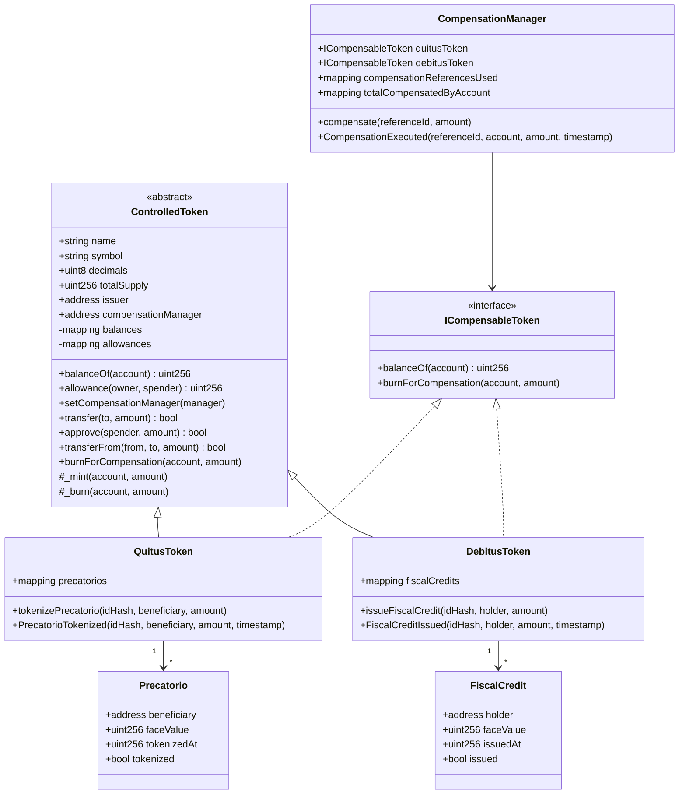

# Diagrama preliminar de classes dos contratos

## Responsabilidades

### `QuitusToken`

Registra um precatório pelo hash de seu identificador institucional e emite QTS para o beneficiário. O mesmo identificador não pode ser tokenizado duas vezes.

### `DebitusToken`

Registra um crédito fiscal pelo hash de seu identificador institucional e emite DBT para o titular. O mesmo identificador não pode gerar duas emissões.

### `CompensationManager`

Coordena a compensação. O titular precisa possuir o mesmo valor em QTS e DBT. As duas queimas acontecem na mesma transação, produzindo um registro único de compensação.

### `ControlledToken`

Fornece as operações fungíveis mínimas compartilhadas pelos tokens. Nesta versão preliminar, somente o emissor configurado no deploy pode criar QTS ou DBT, e somente o `CompensationManager` autorizado pode queimá-los para compensação.

## Evoluções esperadas

- Substituição da implementação fungível mínima por contratos OpenZeppelin;
- Controle de acesso por papéis institucionais;
- Pausa emergencial e governança;
- Oráculo institucional para atualização monetária;
- Estados adicionais do precatório e do crédito fiscal;
- Contrato ou módulo de liquidação do mercado secundário;
- Testes de segurança, invariantes e casos de borda.
