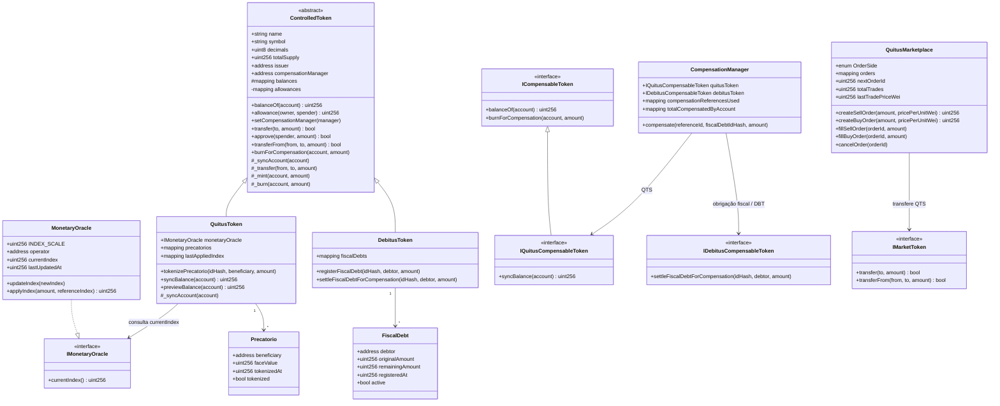

# Diagrama de classes dos contratos

O diagrama abaixo representa os contratos **atualmente implementados**.



## Responsabilidades

### `ControlledToken`

Fornece as operações fungíveis mínimas compartilhadas por QTS e DBT: saldo, allowance, transferência, emissão e queima interna.

Também possui o hook `_syncAccount`. A implementação padrão é vazia; `QuitusToken` sobrescreve esse hook para aplicar a atualização monetária antes de operações que alteram o saldo.

Somente o emissor definido no deploy pode configurar o `CompensationManager`, e somente o gerenciador autorizado pode chamar `burnForCompensation`.

### `MonetaryOracle`

Mock do oráculo institucional.

Mantém um índice cumulativo com escala `1_000_000`, inicia em `1_000_000` e permite que somente `operator` publique um índice igual ou superior ao atual por `updateIndex`.

`applyIndex` realiza apenas um cálculo de referência e não altera QTS.

### `QuitusToken`

Registra um precatório pelo hash de seu identificador institucional e emite QTS para o beneficiário.

Além da tokenização, consulta `MonetaryOracle.currentIndex()` e mantém `lastAppliedIndex` por conta. A atualização monetária é lazy:

- `previewBalance` calcula o saldo corrigido sem alterar estado;
- `syncBalance` materializa a correção;
- transferências, mint e burn chamam `_syncAccount` antes de modificar o saldo;
- a diferença positiva é emitida como QTS adicional e registrada por `MonetaryAdjustmentApplied`.

### `DebitusToken`

Mantém `FiscalDebt`, registrado por `registerFiscalDebt`, com `originalAmount`, `remainingAmount`, devedor e estado ativo. O registro inicial não emite DBT.

Durante a compensação, `settleFiscalDebtForCompensation`:

1. valida a obrigação, o devedor e o saldo remanescente;
2. emite DBT no mesmo valor da parcela;
3. queima imediatamente esse DBT;
4. reduz `remainingAmount`;
5. marca a obrigação como inativa quando o saldo chega a zero;
6. emite `FiscalDebtCompensated`.

A função só pode ser chamada pelo `CompensationManager` autorizado.

### `QuitusMarketplace`

Implementa o mercado secundário simplificado de QTS.

Cada ordem contém:

- `maker`;
- lado (`Sell` ou `Buy`);
- quantidade original;
- quantidade remanescente;
- preço em wei por unidade interna de QTS;
- instante de criação;
- estado ativo.

Nas ordens de venda, os QTS não ficam em custódia do marketplace: o vendedor precisa manter saldo e allowance até a execução.

Nas ordens de compra, o ETH de teste correspondente ao valor total fica em escrow no contrato. Preenchimentos parciais liberam proporcionalmente esse saldo e o cancelamento devolve a parcela remanescente.

Os eventos `OrderCreated`, `OrderFilled` e `OrderCancelled` formam o histórico on-chain das negociações. `lastTradePriceWei` e `totalTrades` expõem indicadores básicos para a interface.

O ETH utilizado nessa PoC é apenas um mock de liquidação e não representa uma decisão de arquitetura para produção.

### `CompensationManager`

Coordena a compensação atualmente implementada.

A função é:

```solidity
compensate(
    bytes32 referenceId,
    bytes32 fiscalDebtIdHash,
    uint256 amount
)
```

Ela:

1. valida os identificadores, o valor e a referência única;
2. chama `QuitusToken.syncBalance(msg.sender)`;
3. exige saldo QTS suficiente;
4. marca a referência como usada;
5. queima QTS;
6. solicita a `DebitusToken` a liquidação da `FiscalDebt`, com emissão e queima transitória de DBT;
7. incrementa `totalCompensatedByAccount`;
8. emite `CompensationExecuted` com a referência e a obrigação fiscal.

Todas as etapas pertencem à mesma transação EVM. Se a obrigação fiscal for inválida, pertencer a outro devedor ou não tiver saldo suficiente, a chamada em `DebitusToken` reverte e a queima anterior de QTS também é desfeita.

## Estado de evolução

Já implementado:

- tokenização e emissão de QTS;
- atualização monetária por `MonetaryOracle`;
- registro explícito de `FiscalDebt`;
- consumo de `FiscalDebt.remainingAmount` pela compensação;
- emissão e queima transitória de DBT;
- compensação atômica entre QTS e a obrigação fiscal;
- mercado secundário com ordens de compra e venda de QTS.

Ainda não implementado:

- frontend;
- scripts de deploy.
