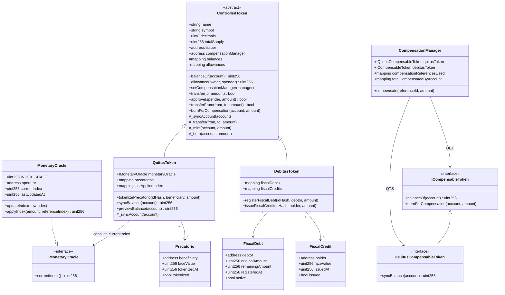

# Diagrama de classes dos contratos

O diagrama abaixo representa os contratos **atualmente implementados**.



## Responsabilidades

### `ControlledToken`

Fornece as operações fungíveis mínimas compartilhadas por QTS e DBT: saldo, allowance, transferência, emissão e queima interna.

Também possui o hook `_syncAccount`. A implementação padrão é vazia; `QuitusToken` sobrescreve esse hook para aplicar a atualização monetária antes de operações que alteram o saldo.

Somente o emissor definido no deploy pode configurar o `CompensationManager`, e somente o gerenciador autorizado pode chamar `burnForCompensation`.

### `MonetaryOracle`

Mock do oráculo institucional.

Mantém um índice cumulativo com escala `1_000_000`, inicia em `1_000_000` e permite que somente `operator` publique um índice igual ou superior ao atual por `updateIndex`.

`applyIndex` realiza apenas um cálculo de referência e não altera QTS.

### `QuitusToken`

Registra um precatório pelo hash de seu identificador institucional e emite QTS para o beneficiário.

Além da tokenização, consulta `MonetaryOracle.currentIndex()` e mantém `lastAppliedIndex` por conta. A atualização monetária é lazy:

- `previewBalance` calcula o saldo corrigido sem alterar estado;
- `syncBalance` materializa a correção;
- transferências, mint e burn chamam `_syncAccount` antes de modificar o saldo;
- a diferença positiva é emitida como QTS adicional e registrada por `MonetaryAdjustmentApplied`.

### `DebitusToken`

Atualmente mantém **dois modelos em paralelo durante a evolução da Entrega 2**:

1. `FiscalDebt`, registrado por `registerFiscalDebt`, com `originalAmount`, `remainingAmount`, devedor e estado ativo. Essa operação não emite DBT;
2. `FiscalCredit`, registrado por `issueFiscalCredit`, que continua emitindo DBT antecipadamente ao titular para manter compatibilidade com a compensação atual.

O registro `FiscalDebt` ainda não é consumido pelo `CompensationManager`.

### `CompensationManager`

Coordena a compensação atualmente implementada.

A função é:

```solidity
compensate(bytes32 referenceId, uint256 amount)
```

Ela:

1. valida referência e valor;
2. chama `QuitusToken.syncBalance(msg.sender)`;
3. exige que o solicitante possua pelo menos `amount` em QTS **e** DBT;
4. marca a referência como usada;
5. chama `burnForCompensation` nos dois tokens;
6. incrementa `totalCompensatedByAccount`;
7. emite `CompensationExecuted`.

As duas queimas pertencem à mesma transação EVM. Se uma etapa reverter, todo o estado da operação é revertido.

## Estado de evolução

Já implementado:

- tokenização e emissão de QTS;
- atualização monetária por `MonetaryOracle`;
- registro explícito de `FiscalDebt`;
- emissão legada de DBT por `issueFiscalCredit`;
- compensação atômica baseada em saldos QTS + DBT.

Ainda não implementado:

- consumo de `FiscalDebt.remainingAmount` pela compensação;
- emissão transitória de DBT durante a compensação;
- mercado secundário;
- frontend;
- testes automatizados e scripts de deploy.
