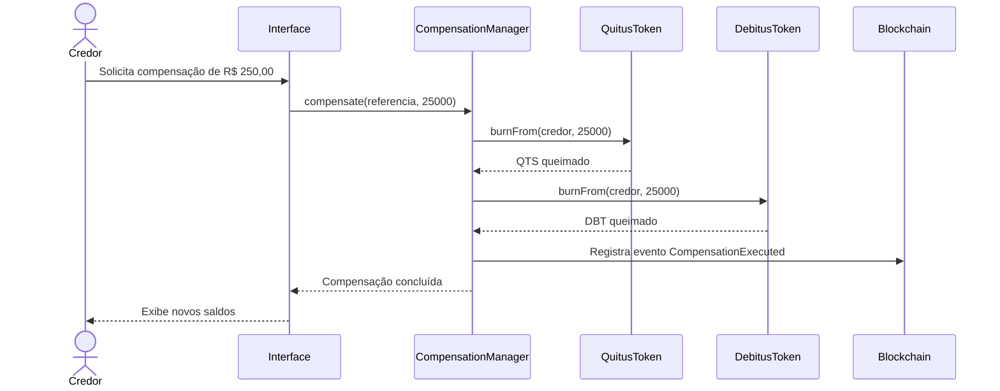

# Fluxo de compensação

```mermaid
sequenceDiagram
    actor Credor
    participant Interface
    participant Manager as CompensationManager
    participant QTS as QuitusToken
    participant DBT as DebitusToken
    participant Blockchain

    Credor->>Interface: Solicita compensação de R$ 250,00
    Interface->>Manager: compensate(referencia, 25000)

    Manager->>QTS: burnFrom(credor, 25000)
    QTS-->>Manager: QTS queimado

    Manager->>DBT: burnFrom(credor, 25000)
    DBT-->>Manager: DBT queimado

    Manager->>Blockchain: Registra evento CompensationExecuted
    Manager-->>Interface: Compensação concluída
    Interface-->>Credor: Exibe novos saldos
```