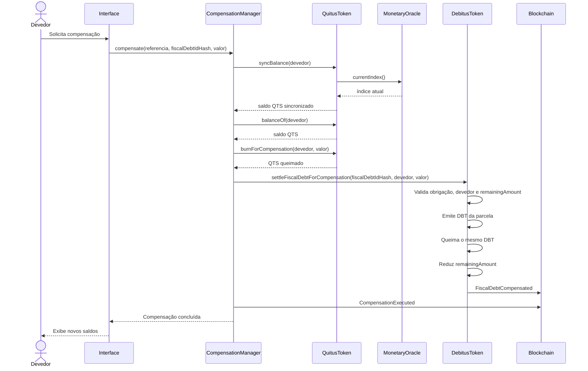

# Fluxo de compensação

Este diagrama representa a compensação atualmente implementada.



## DBT transitório

O devedor não precisa possuir DBT antes da operação.

Para uma compensação de `25000` unidades:

```text
saldo DBT antes:  0
mint durante:     25000
burn durante:     25000
saldo DBT depois: 0
```

Os eventos `Transfer` registram a emissão e a queima, enquanto `FiscalDebtCompensated` registra a redução da obrigação fiscal.

## Atomicidade

Todas as operações são executadas dentro da mesma transação iniciada por `CompensationManager.compensate`.

Por exemplo, o manager queima QTS antes de chamar `settleFiscalDebtForCompensation`. Se `DebitusToken` detectar que `remainingAmount` é insuficiente e reverter, a EVM também desfaz:

- a queima de QTS;
- a marcação de `compensationReferencesUsed`;
- a sincronização monetária de QTS feita na transação;
- qualquer outra alteração anterior daquela compensação.

Assim, não existe estado persistido com apenas uma parte da compensação executada.
