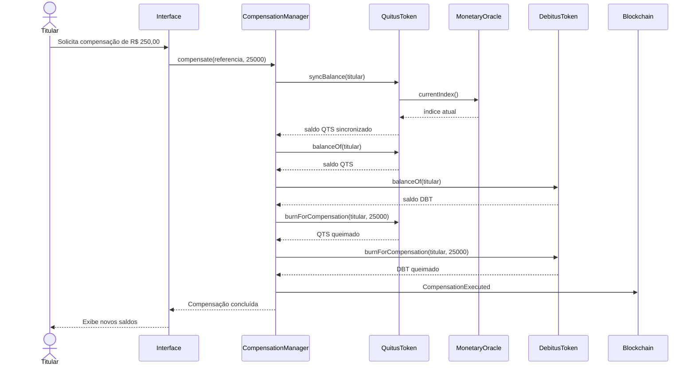

# Fluxo de compensação

Este diagrama representa a **compensação atualmente implementada**. Embora `DebitusToken` já possua `registerFiscalDebt`, o `CompensationManager` ainda não utiliza `FiscalDebt` nesta operação.



## Atomicidade

As duas chamadas `burnForCompensation` são executadas dentro da mesma transação de `CompensationManager.compensate`.

Se a segunda queima ou qualquer outra etapa reverter, a EVM também desfaz:

- a primeira queima;
- a marcação de `compensationReferencesUsed`;
- a atualização de `totalCompensatedByAccount`;
- qualquer sincronização de QTS realizada dentro da mesma transação.

## Limitação atual

O registro criado por:

```solidity
registerFiscalDebt(bytes32 fiscalDebtIdHash, address debtor, uint256 amount)
```

ainda não participa da compensação. A função atual exige um saldo DBT previamente emitido por `issueFiscalCredit`.

A integração de `FiscalDebt.remainingAmount` e a emissão transitória de DBT serão alterações posteriores.
