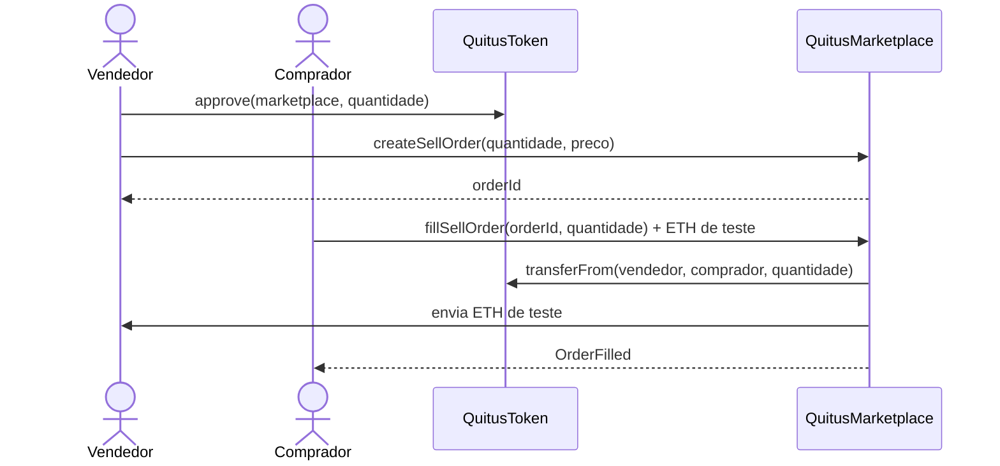
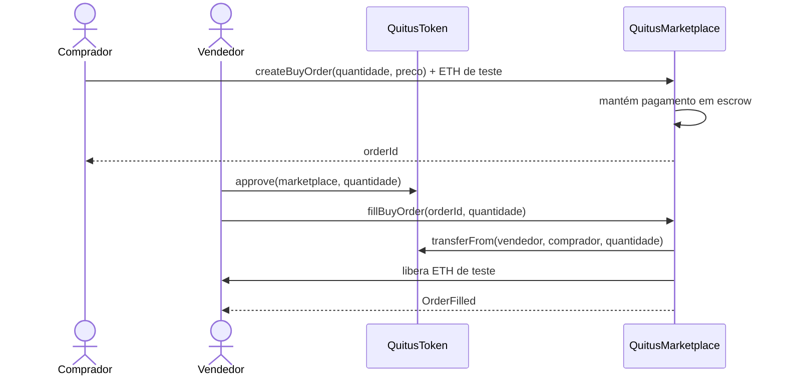

# Fluxo do mercado secundário

`QuitusMarketplace` implementa um livro de ordens simplificado para QTS.

O preço de uma ordem é expresso em **wei por unidade interna de QTS**. Como o token possui duas casas decimais, `1` unidade interna corresponde a `0,01 QTS`.

## Oferta de venda



Os QTS permanecem na carteira do vendedor enquanto a ordem está aberta. Portanto, a execução falha se o vendedor não mantiver saldo ou allowance suficientes.

## Oferta de compra



## Execução parcial e cancelamento

Uma ordem pode ser preenchida em várias operações até `remaining` chegar a zero.

O criador também pode executar:

```solidity
cancelOrder(orderId)
```

Nas ordens de compra, o ETH de teste ainda reservado para `remaining` é devolvido ao comprador.

## Histórico

Os eventos:

```text
OrderCreated
OrderFilled
OrderCancelled
```

permitem reconstruir o histórico de oferta, demanda e preços negociados. O contrato também mantém `totalTrades` e `lastTradePriceWei` para consultas simples.

## Limitação

ETH é utilizado apenas como mecanismo de liquidação da PoC. Uma implantação institucional precisaria definir um meio de pagamento regulado e a integração correspondente.
