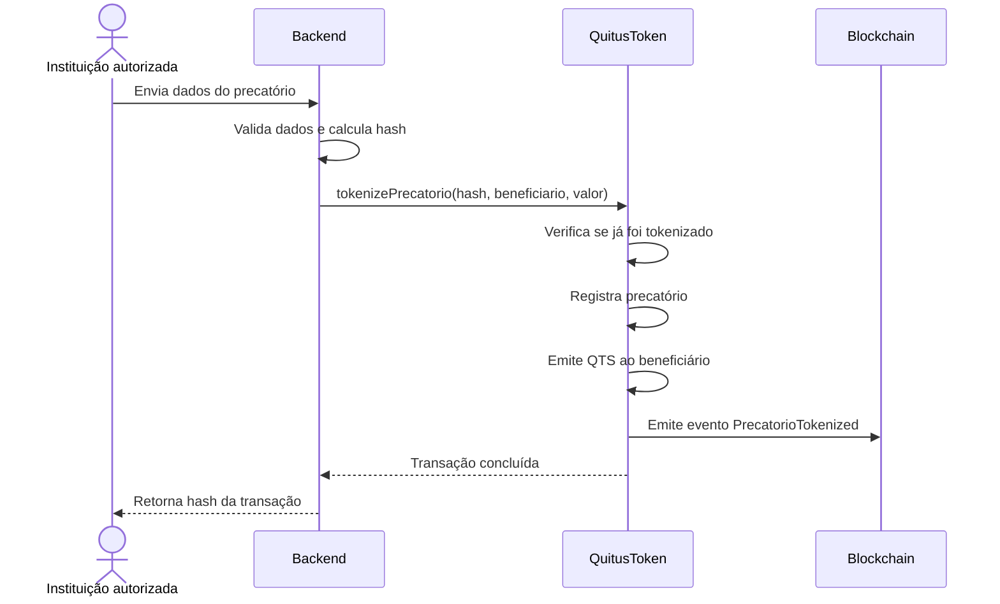

# Fluxo de tokenização de precatório

```mermaid
sequenceDiagram
    actor Instituicao as Instituição autorizada
    participant Backend
    participant QTS as QuitusToken
    participant Blockchain

    Instituicao->>Backend: Envia dados do precatório
    Backend->>Backend: Valida dados e calcula hash
    Backend->>QTS: tokenizePrecatorio(hash, beneficiario, valor)
    QTS->>QTS: Verifica se já foi tokenizado
    QTS->>QTS: Registra precatório
    QTS->>QTS: Emite QTS ao beneficiário
    QTS->>Blockchain: Emite evento PrecatorioTokenized
    QTS-->>Backend: Transação concluída
    Backend-->>Instituicao: Retorna hash da transação
```