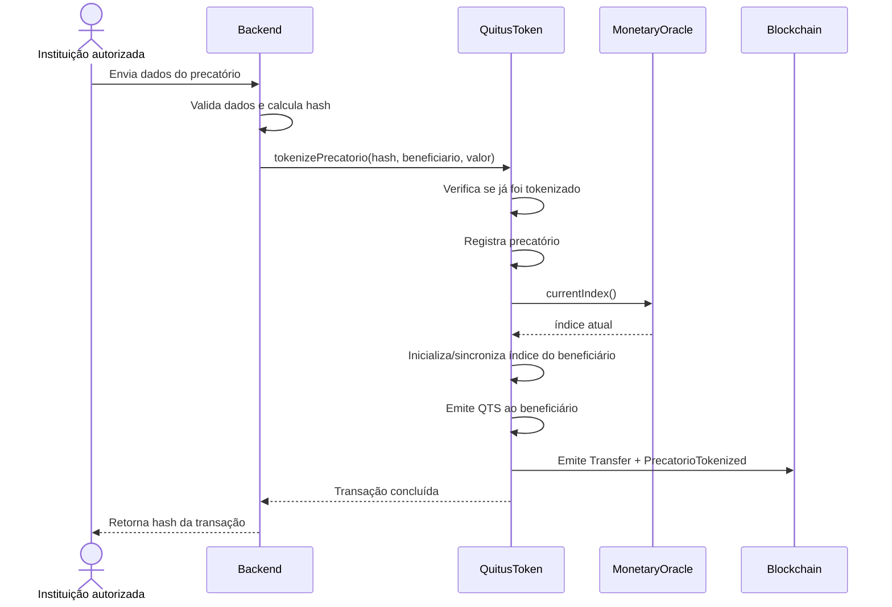
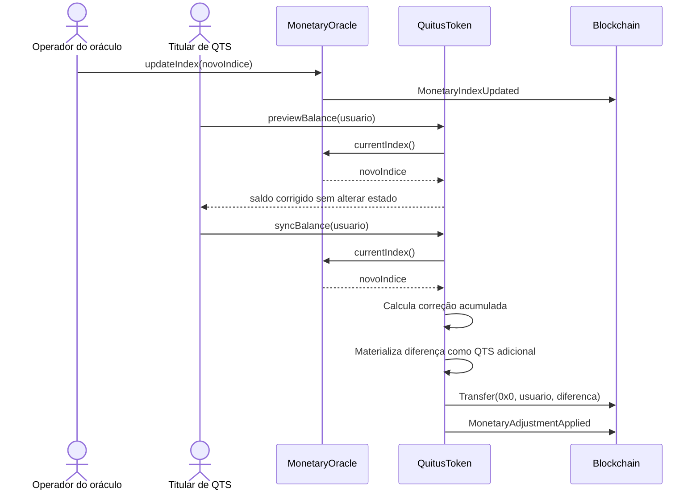

# Fluxo de tokenização de precatório

## Tokenização atualmente implementada

`QuitusToken` usa duas casas decimais. Por exemplo, `100000` unidades representam R$ 1.000,00.

## Atualização monetária

Depois da tokenização, o operador autorizado pode publicar um novo índice em `MonetaryOracle`.

A sincronização também ocorre automaticamente antes de transferências, mint e burn que alterem o saldo da conta.
