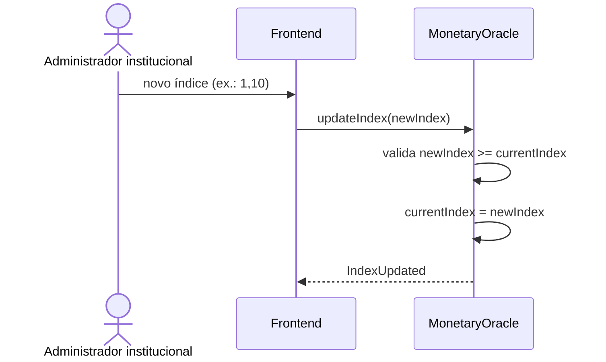
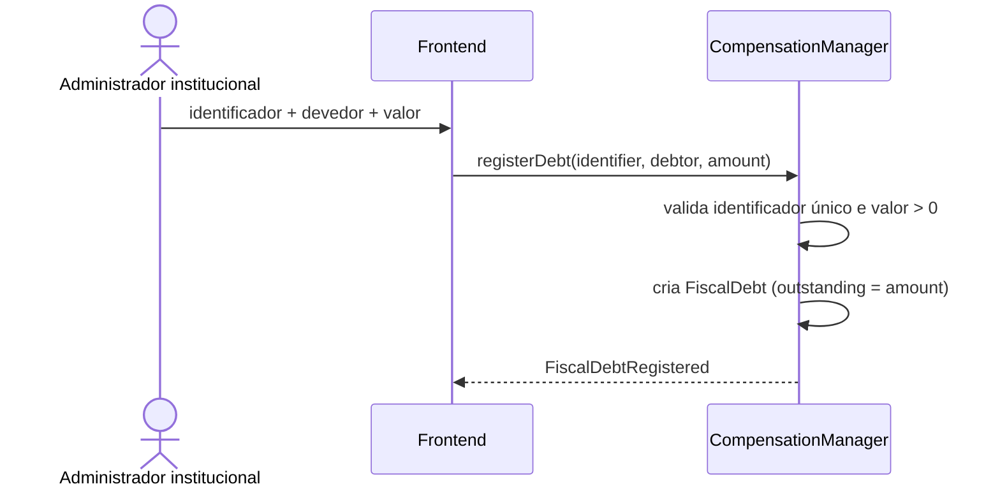
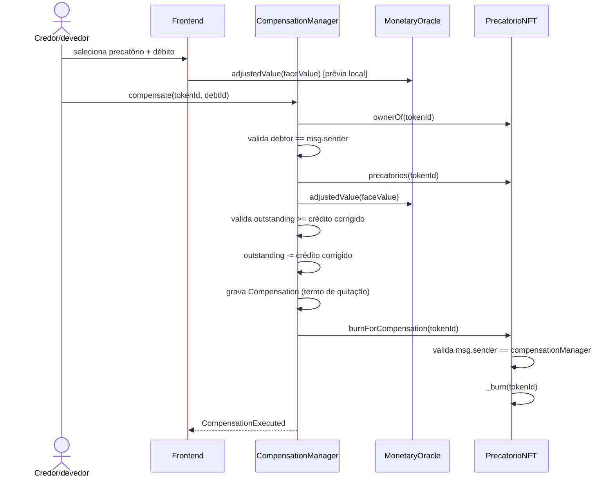

# Fluxo de correção monetária e compensação atômica

Este fluxo cobre o segundo destino possível de um precatório tokenizado: em vez de vendê-lo no mercado secundário, o próprio credor pode usá-lo para quitar um débito fiscal seu, com o valor de face corrigido monetariamente.

## Publicação do índice de correção



O índice é monotônico: `updateIndex` rejeita valor menor que o vigente. `adjustedValue(faceValue)` é `view` e permanece consultável mesmo com o oráculo pausado.

## Registro de débito fiscal mock



O devedor registrado precisa, no momento da compensação, ser também o proprietário do precatório usado como crédito — a PoC não permite compensar em nome de terceiros.

## Compensação atômica



Todos os passos acontecem na mesma transação: se o débito não comportar o crédito corrigido (`DebtSmallerThanCredit`) ou qualquer chamada reverter, a EVM desfaz tudo — não existe estado intermediário com débito abatido e precatório ainda vivo, nem o contrário. O frontend calcula a mesma fórmula (`faceValue × índice / 1e18`) localmente antes de enviar a transação, para recusar de antemão combinações que reverteriam on-chain.

Como um ERC-721 não admite consumo parcial, o débito precisa comportar o crédito corrigido inteiro; ele pode ser maior e permanece com saldo remanescente após a compensação. Justificativa completa em [`decisoes/oraculo-e-compensacao.md`](../decisoes/oraculo-e-compensacao.md).

## Termo de quitação

O frontend não lê um histórico dedicado: reconstitui a lista de compensações executadas a partir do evento `CompensationExecuted`, com precatório, débito, credor, valor de face, valor corrigido e data — o registro em `compensations` no contrato serve de fonte de verdade, mas a UI consulta apenas os eventos.

## Estados administrativos

```text
pause()
→ bloqueio temporário de registerDebt/compensate (MonetaryOracle e CompensationManager)

upgrade
→ troca de implementação enquanto o proxy for válido

invalidate()
→ bloqueio permanente
→ sem unpause
→ sem novos débitos, publicações de índice ou compensações
→ débitos e termos de quitação continuam consultáveis
```
