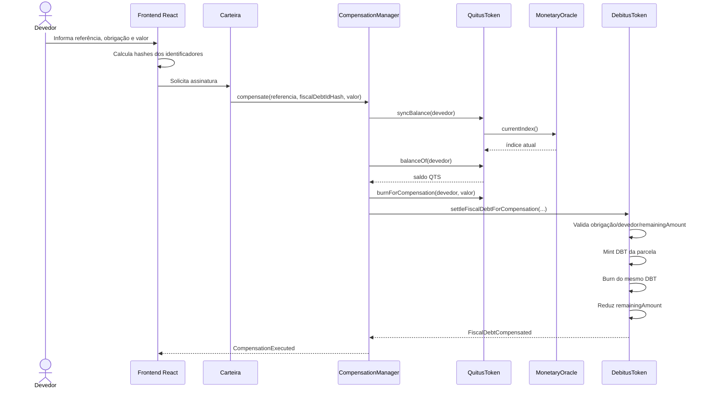

# Fluxo de compensação



## DBT transitório

O devedor não precisa possuir DBT previamente. Em uma compensação de `25000` unidades:

```text
saldo DBT antes:  0
mint durante:     25000
burn durante:     25000
saldo DBT depois: 0
```

O DBT registra tecnicamente a parcela fiscal processada sem criar saldo persistente para o usuário.

## Atomicidade

Todas as alterações pertencem à mesma transação EVM. Se `DebitusToken` rejeitar a obrigação — por exemplo, porque `remainingAmount` é insuficiente — também são revertidos a queima de QTS, a marcação da referência e qualquer sincronização feita naquela transação.
