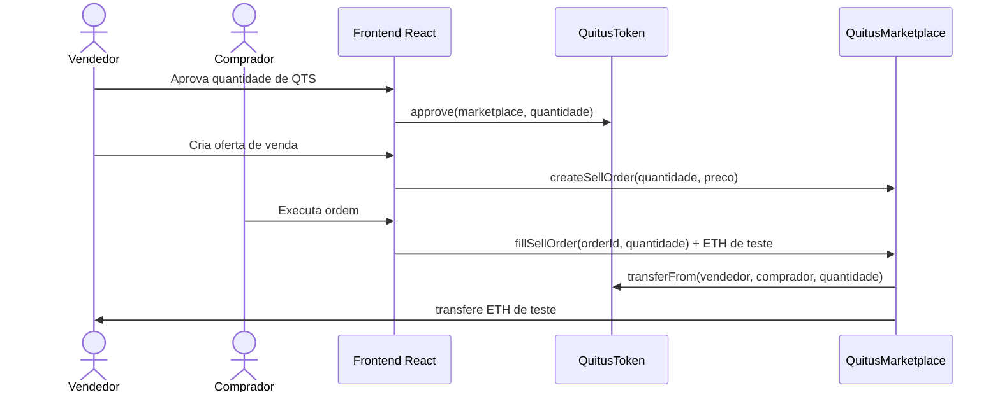
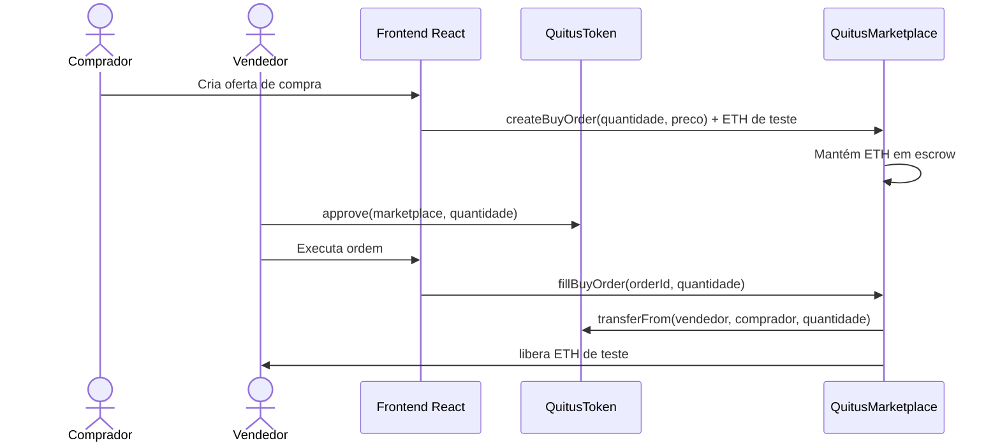

# Fluxo do mercado secundário

`QuitusMarketplace` mantém um livro de ordens simplificado de QTS. O frontend lê as ordens diretamente do contrato e envia as transações pela carteira.

O preço é expresso em **wei por unidade interna de QTS**; `1` unidade interna equivale a `0,01 QTS`.

## Oferta de venda

Os QTS permanecem na carteira do vendedor enquanto a ordem está aberta; saldo e allowance precisam continuar suficientes na execução.

## Oferta de compra

## Execução parcial e cancelamento

Uma ordem pode ser preenchida em parcelas até `remaining == 0`. O maker pode executar `cancelOrder(orderId)`; em ordens de compra, o escrow referente ao saldo remanescente é devolvido.

## Histórico

`OrderCreated`, `OrderFilled` e `OrderCancelled` permitem reconstruir a atividade do mercado. A interface também consulta `totalTrades` e `lastTradePriceWei`.

## Limitação

O ETH é apenas um mock técnico de liquidação da PoC, não uma escolha de meio de pagamento para implantação institucional.
