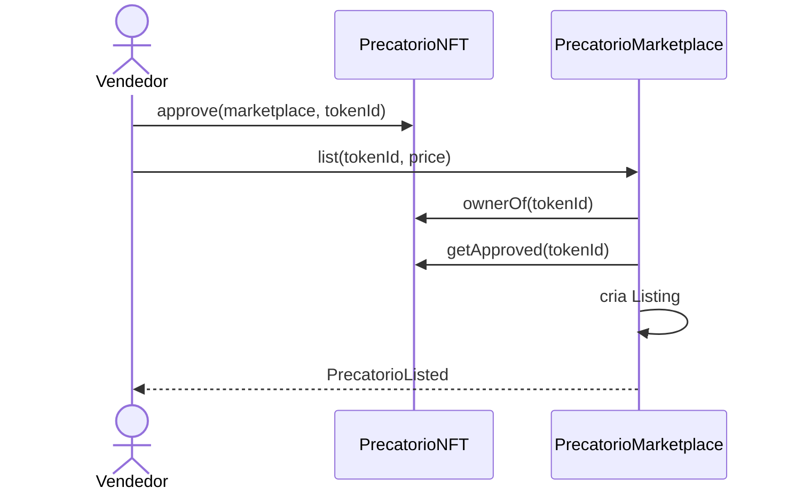
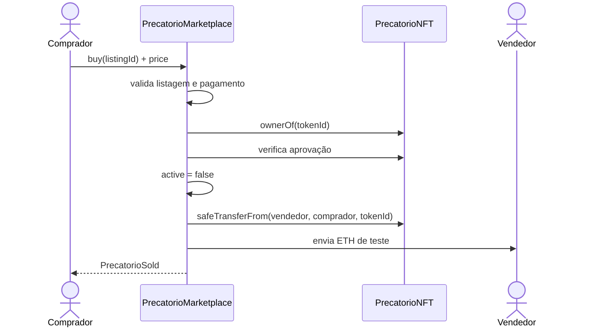
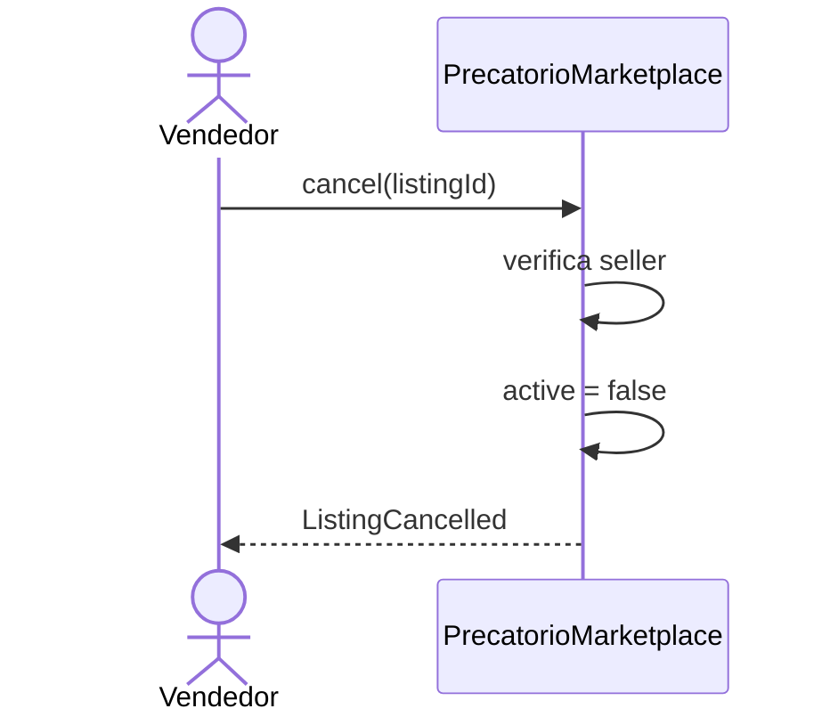
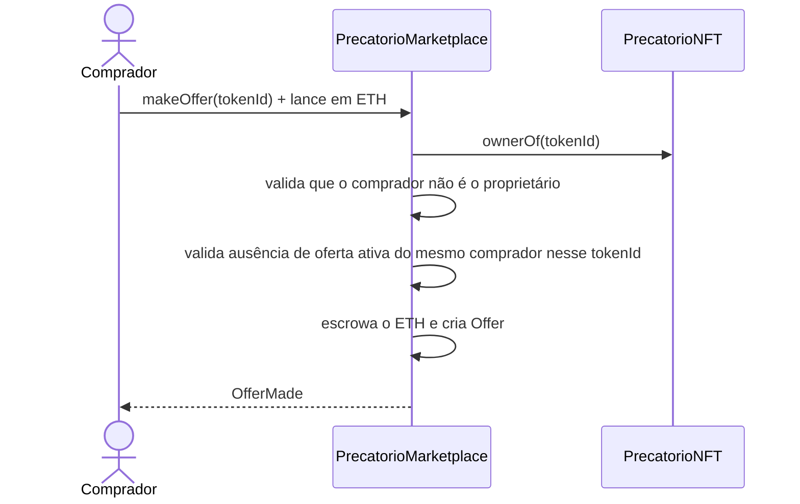
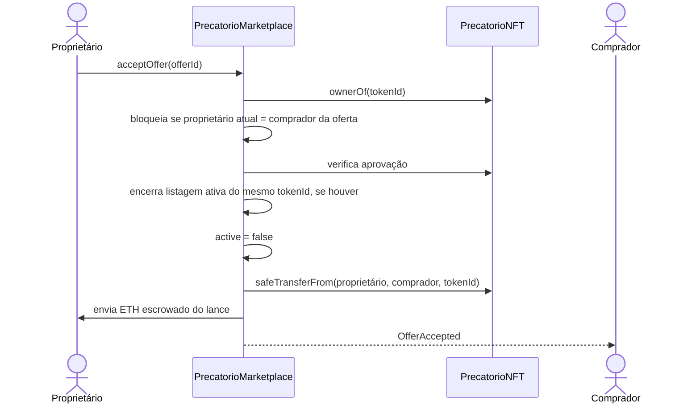
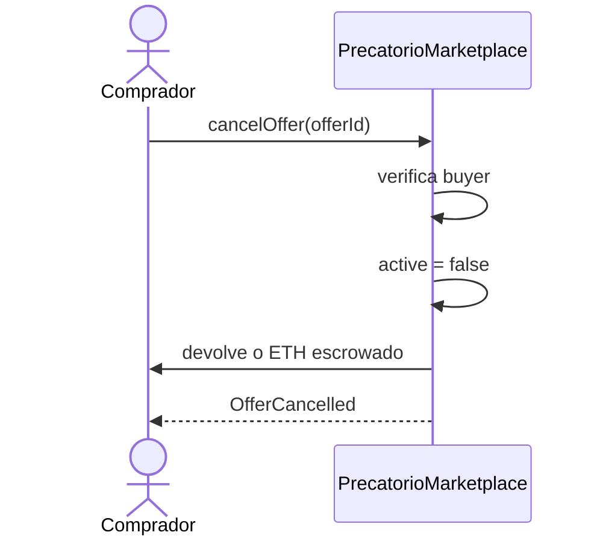

# Fluxo do mercado secundário

O mercado secundário tem dois lados independentes: a listagem a preço fixo (oferta do vendedor) e o lance escrowado (demanda do comprador). Os dois alimentam o mesmo histórico de preços.

## Listagem



O NFT não fica em custódia do marketplace durante a espera por comprador.

## Compra



A alteração de estado ocorre antes das chamadas externas e existe proteção contra reentrada no fluxo de compra.

Se a transferência do NFT ou o pagamento falhar, a transação é revertida integralmente.

## Cancelamento



## Oferta (lance sem listagem prévia)



O ETH do lance fica retido no próprio contrato — não há transferência de NFT nesta etapa.

## Aceite de oferta



Quem aceita é sempre o proprietário **atual** do `tokenId`, não necessariamente quem era proprietário quando o lance foi feito: uma oferta sobrevive a uma venda por listagem do mesmo NFT, entrando para o novo proprietário decidir. A exceção é quando o proprietário atual é o próprio comprador da oferta — por exemplo, após uma transferência direta fora do marketplace. Nesse caso, o autoaceite é rejeitado e o comprador deve cancelar a oferta para recuperar o ETH escrowado.

## Cancelamento de oferta



`cancelOffer` funciona mesmo com o marketplace pausado ou invalidado — é a única função mutável do contrato sem essa restrição, para que o depósito do comprador nunca fique preso.

## Histórico de preços

O frontend não lê um histórico on-chain dedicado: ele agrega os eventos `PrecatorioSold` (venda por listagem) e `OfferAccepted` (venda por oferta aceita), ordena por timestamp e apresenta como histórico de preços do mercado secundário.

## Estados administrativos

```text
pause()
→ bloqueio temporário das operações
→ cancelOffer continua funcionando (devolução de saldo do próprio comprador)

upgrade
→ troca de implementação enquanto o proxy for válido

invalidate()
→ bloqueio permanente
→ sem unpause
→ sem novas listagens, ofertas ou aceites
→ sem novos upgrades
→ cancelOffer continua funcionando
```
