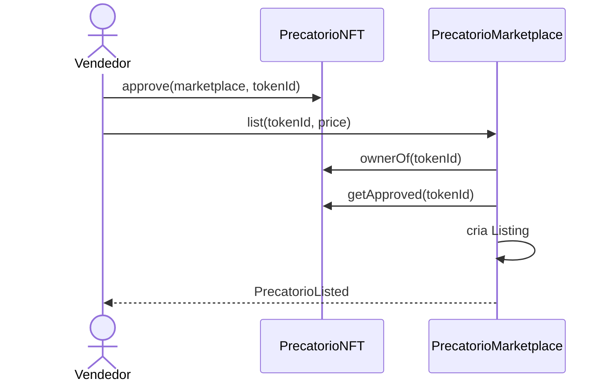
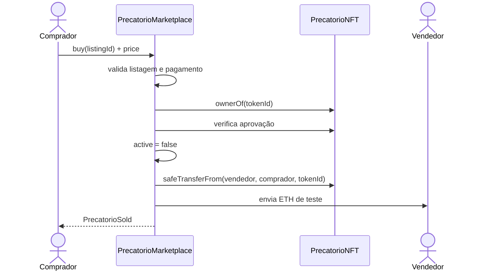
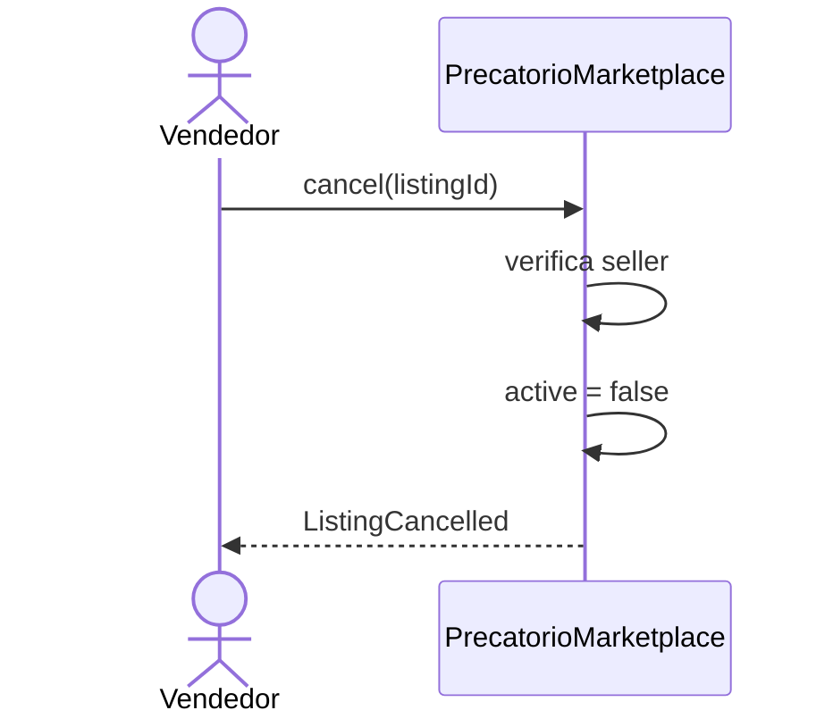

# Fluxo do mercado secundário

## Listagem



O NFT não fica em custódia do marketplace durante a espera por comprador.

## Compra



A alteração de estado ocorre antes das chamadas externas e existe proteção contra reentrada no fluxo de compra.

Se a transferência do NFT ou o pagamento falhar, a transação é revertida integralmente.

## Cancelamento



## Estados administrativos

```text
pause()
→ bloqueio temporário das operações

upgrade
→ troca de implementação enquanto o proxy for válido

invalidate()
→ bloqueio permanente
→ sem unpause
→ sem novas operações
→ sem novos upgrades
```
