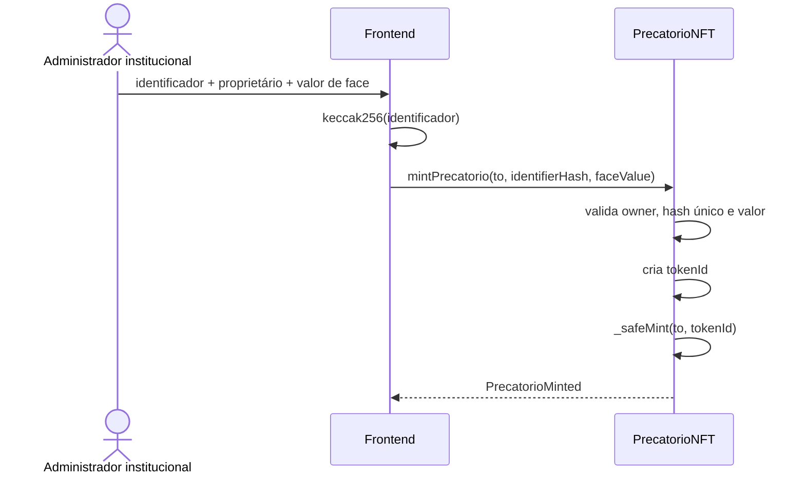

# Fluxo de tokenização do precatório

A entrada da PoC é deliberadamente simples e não exige upload de documentos.

## Regras

- somente o owner institucional do contrato pode mintar;
- endereço de destino deve ser válido;
- identificador não pode ser vazio;
- identificador não pode ser reutilizado;
- valor de face deve ser maior que zero;
- contrato não pode estar pausado ou invalidado.

O resultado é um ERC-721 cuja propriedade pode ser consultada por `ownerOf(tokenId)`.
