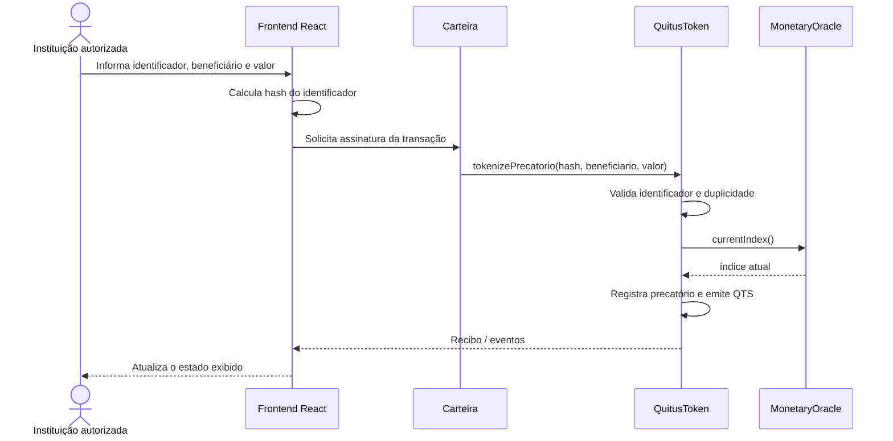
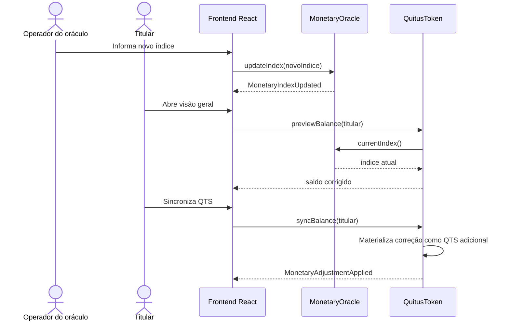

# Fluxo de tokenização de precatório

## Tokenização

A interface não valida juridicamente o precatório. Ela apenas transforma o identificador informado em `bytes32` e envia a operação autorizada ao contrato.

`QuitusToken` usa duas casas decimais: `100000` unidades internas representam R$ 1.000,00.

## Atualização monetária

A sincronização também ocorre automaticamente antes de transferências, mints e queimas que alterem o saldo.
