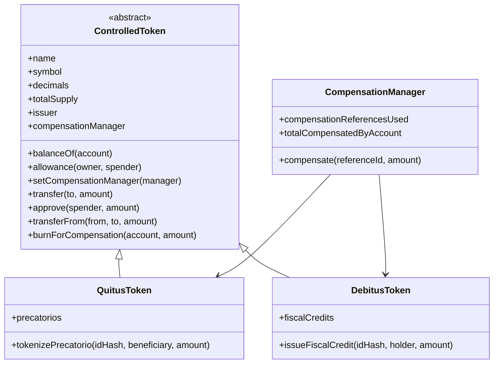
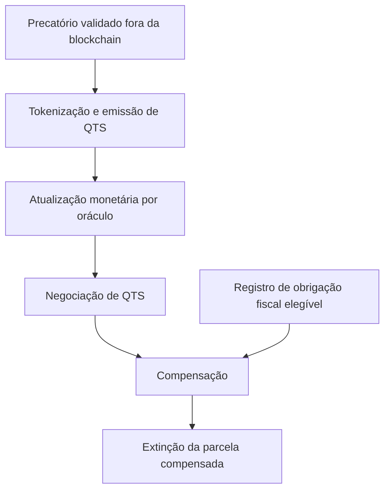

# Modelo da solução

Este documento registra como o protótipo existente será evoluído para a prova de conceito final do **Quitus & Debitus**.

Ele parte diretamente do código já existente em `contracts/Projeto4Entrega1.sol`. Funcionalidades descritas como **planejadas** neste documento ainda não devem ser interpretadas como implementadas.

## Protótipo existente

O código atual possui quatro componentes principais:



### QTS no código atual

`QuitusToken` registra:

```solidity
struct Precatorio {
    address beneficiary;
    uint256 faceValue;
    uint256 tokenizedAt;
    bool tokenized;
}
```

A operação central é:

```solidity
tokenizePrecatorio(
    bytes32 precatorioIdHash,
    address beneficiary,
    uint256 amount
)
```

Somente o `issuer` pode executá-la. O mesmo `precatorioIdHash` não pode ser tokenizado novamente.

### DBT no código atual

`DebitusToken` registra:

```solidity
struct FiscalCredit {
    address holder;
    uint256 faceValue;
    uint256 issuedAt;
    bool issued;
}
```

A operação atual é:

```solidity
issueFiscalCredit(
    bytes32 fiscalCreditIdHash,
    address holder,
    uint256 amount
)
```

Ela emite DBT antecipadamente para o titular.

### Compensação no código atual

A função existente é:

```solidity
compensate(
    bytes32 referenceId,
    uint256 amount
)
```

Ela exige que `msg.sender` possua, antes da chamada, pelo menos `amount` em QTS e em DBT.

Depois:

```text
CompensationManager
    ├── burnForCompensation(QTS)
    └── burnForCompensation(DBT)
```

As duas chamadas pertencem à mesma transação. Se uma delas falhar, toda a operação é revertida.

---

## Evolução funcional

A proposta completa do projeto exige que a prova de conceito represente, além da tokenização, a atualização monetária, a negociação de QTS e a compensação.

O fluxo pretendido para a evolução é:



### Princípio importante

A blockchain não decidirá se um precatório ou uma obrigação fiscal é juridicamente válido.

A prova de conceito assume que a validação institucional ocorre **off-chain** e demonstra apenas o registro e a execução técnica das operações autorizadas.

---

## Quitus (QTS)

QTS continuará sendo o token associado ao valor do precatório.

A implementação existente de:

```solidity
tokenizePrecatorio(...)
```

será preservada conceitualmente.

A evolução deverá acrescentar a atualização monetária sem quebrar as regras já existentes:

- somente instituição autorizada emite;
- identificador não pode ser vazio;
- precatório não pode ser tokenizado duas vezes;
- beneficiário deve ser válido;
- valor deve ser maior que zero.

### Convenção monetária

O código existente utiliza:

```solidity
uint8 public constant decimals = 2;
```

Assim:

```text
100 unidades internas = R$ 1,00
100000 unidades internas = R$ 1.000,00
```

Essa convenção será mantida, salvo necessidade técnica devidamente documentada.

---

## Atualização monetária por oráculo

Será adicionado um **oráculo simulado** para representar a atualização monetária exigida pela proposta.

O oráculo deverá:

- possuir operador autorizado;
- armazenar um índice cumulativo;
- rejeitar valores inválidos;
- emitir evento quando o índice mudar.

Uma interface possível é:

```solidity
updateIndex(uint256 newIndex)
```

A assinatura exata será definida no código.

### Aplicação da atualização

A intenção é evitar percorrer todos os titulares a cada atualização.

Por isso, a evolução deve preferir um mecanismo de atualização calculada/sincronizada quando o saldo for utilizado ou consultado pela lógica que altera estado.

Exemplo conceitual:

```text
saldo anterior:     1.000,00 QTS
índice anterior:    1,000000
índice atual:       1,010000
saldo atualizado:   1.010,00 QTS
```

O índice usado na prova de conceito será simulado. Ele não representa uma fonte oficial nem implementa todas as regras reais de correção monetária.

---

## Crédito ou obrigação fiscal e papel do DBT

O código atual interpreta o DBT como um token previamente emitido ao usuário por `issueFiscalCredit(...)`.

A proposta de origem descreve um fluxo em que o DBT participa da própria compensação. Por isso, a implementação será revista.

A evolução pretendida é registrar explicitamente a obrigação fiscal elegível e tratar o DBT como representação técnica da parcela compensada.

Uma estrutura possível é:

```solidity
struct FiscalDebt {
    address debtor;
    uint256 originalAmount;
    uint256 remainingAmount;
    uint256 registeredAt;
    bool active;
}
```

E uma operação institucional semelhante a:

```solidity
registerFiscalDebt(
    bytes32 debtIdHash,
    address debtor,
    uint256 amount
)
```

Os nomes definitivos serão escolhidos no código.

### Terminologia

Os documentos fornecidos para o projeto utilizam expressões como **créditos fiscais**, **dívida ativa** e **devedor fiscal**.

A implementação deve evitar atribuir uma interpretação jurídica mais específica do que a validada pelo projeto. O contrato representa tecnicamente uma obrigação fiscal elegível para a demonstração.

---

## Compensação pretendida

No protótipo final, o devedor não deverá precisar manter um saldo DBT antecipadamente apenas para executar a compensação.

O fluxo pretendido é:

```text
devedor possui QTS
        +
obrigação fiscal registrada
        ↓
solicita compensação
        ↓
DBT representa a parcela fiscal da operação
        ↓
QTS e DBT são extintos
        ↓
saldo remanescente da obrigação é reduzido
```

Tudo deve ocorrer na mesma transação EVM.

Uma possível interface é:

```solidity
compensate(
    bytes32 referenceId,
    bytes32 fiscalDebtId,
    uint256 amount
)
```

A assinatura final será definida pela implementação.

### Regras esperadas

- referência válida e ainda não utilizada;
- valor maior que zero;
- obrigação existente e ativa;
- solicitante corresponde ao devedor;
- QTS suficiente;
- valor não excede a obrigação remanescente;
- nenhuma alteração parcial persiste se a operação falhar.

---

## Mercado secundário de QTS

A prova de conceito deverá permitir uma negociação simples de QTS.

O objetivo é demonstrar o caminho entre:

```text
credor original → QTS → comprador/devedor fiscal
```

O escopo mínimo planejado é:

- criar oferta de venda;
- consultar ofertas;
- comprar total ou parcialmente;
- cancelar oferta;
- registrar eventos.

O contrato de mercado não deverá criar QTS. Ele apenas movimentará tokens já existentes.

### Liquidação na prova de conceito

Caso seja necessário demonstrar a troca financeira sem integração bancária, poderá ser usado **ETH de teste** apenas como mock técnico.

Isso não significa que a solução institucional proposta utilizaria ETH como moeda de liquidação.

---

## Cenário de demonstração pretendido

O cenário final deverá conseguir representar, de ponta a ponta:

```text
1. instituição tokeniza precatório de R$ 1.000,00
2. credor recebe 1.000,00 QTS
3. oráculo publica uma atualização simulada
4. saldo QTS é atualizado
5. credor oferta parte dos QTS
6. devedor fiscal adquire QTS
7. autoridade fiscal registra obrigação elegível
8. devedor solicita compensação
9. parcela correspondente é extinta atomicamente
10. saldos e eventos são consultados
```

Os valores concretos poderão ser ajustados durante os testes.

---

## On-chain e off-chain

### On-chain

A evolução pode registrar:

- hash do precatório;
- QTS e saldos;
- índice monetário utilizado;
- hash/referência da obrigação fiscal;
- saldo remanescente da obrigação;
- referências de compensação;
- ofertas do mercado secundário;
- eventos das operações.

### Off-chain

Continuam fora da blockchain:

- PDFs;
- peças processuais;
- CPF/CNPJ;
- dados bancários;
- documentos comprobatórios;
- autenticação institucional real;
- análise de elegibilidade;
- integração real com TJPB e Fazenda Pública;
- fonte oficial do índice monetário;
- identidade civil associada às wallets.

---

## Limites

Mesmo após a evolução, a prova de conceito não deverá ser apresentada como sistema jurídico ou financeiro completo.

Ela não garante, por si só:

- validade jurídica de um precatório;
- validade ou exigibilidade da obrigação fiscal;
- autorização legal definitiva para compensação;
- identidade real do usuário por trás de um endereço;
- integração real com órgãos públicos;
- cálculo oficial de correção monetária;
- liquidação financeira em moeda fiduciária;
- custódia institucional de chaves;
- segurança equivalente à de contratos auditados;
- governança de uma rede institucional;
- implantação efetiva em infraestrutura permissionada.

---

## Relação com os diagramas existentes

Os arquivos `docs/arquitetura.md`, `docs/contratos.md`, `docs/fluxo-tokenizacao.md`, `docs/fluxo-compensacao.md` e `docs/roteiro-demo.md` foram produzidos para o protótipo inicial.

Eles não serão atualizados antecipadamente para descrever código ainda inexistente.

Depois que os contratos e a interface forem evoluídos, esses documentos deverão ser revisados para corresponder ao comportamento realmente implementado e testado.
