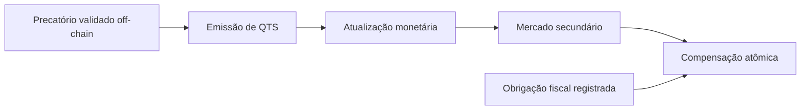

# Modelo da solução

Este documento descreve o modelo funcional **atualmente implementado** na prova de conceito Quitus & Debitus. O código on-chain está em [`../blockchain/contracts/`](../blockchain/contracts/) e a interface em [`../frontend/`](../frontend/).

## Objetivo da PoC

Demonstrar tecnicamente o seguinte ciclo:



A blockchain não decide se um precatório ou obrigação fiscal é juridicamente válido. A PoC assume que essa validação institucional ocorre fora da cadeia e registra/executa apenas as operações autorizadas.

## Quitus — QTS

`QuitusToken` representa o valor tokenizado de um precatório.

```solidity
tokenizePrecatorio(
    bytes32 precatorioIdHash,
    address beneficiary,
    uint256 amount
)
```

Regras principais:

- somente `issuer` emite;
- identificador não pode ser vazio;
- o mesmo precatório não pode ser tokenizado duas vezes;
- beneficiário deve ser válido;
- valor deve ser maior que zero.

### Convenção monetária

QTS usa duas casas decimais:

```text
100 unidades internas = R$ 1,00
100000 unidades internas = R$ 1.000,00
```

## Atualização monetária

`MonetaryOracle` mantém um índice cumulativo controlado por um `operator`.

```text
1_000_000 = 1,000000
1_010_000 = 1,010000
```

Somente o operador pode executar:

```solidity
updateIndex(uint256 newIndex)
```

O índice não pode ser zero nem diminuir.

### Atualização lazy de QTS

Cada conta QTS mantém o último índice aplicado. A publicação de um novo índice não percorre todos os titulares.

```solidity
previewBalance(address account)
syncBalance(address account)
```

`previewBalance` calcula o saldo corrigido sem alterar estado. `syncBalance` materializa a diferença como emissão adicional de QTS. Transferências, mints e burns também sincronizam as contas envolvidas.

Exemplo:

```text
saldo persistido:       100000
último índice:           1000000
índice atual:            1010000
saldo após sync:         101000
QTS adicional emitido:    1000
```

O índice da PoC é simulado; não representa integração com uma fonte oficial nem reproduz todas as regras jurídicas de correção monetária.

## Obrigação fiscal — DBT

`DebitusToken` registra uma obrigação fiscal elegível:

```solidity
struct FiscalDebt {
    address debtor;
    uint256 originalAmount;
    uint256 remainingAmount;
    uint256 registeredAt;
    bool active;
}
```

Cadastro institucional:

```solidity
registerFiscalDebt(
    bytes32 fiscalDebtIdHash,
    address debtor,
    uint256 amount
)
```

O cadastro **não emite DBT**.

### DBT transitório

DBT aparece somente durante a compensação. `settleFiscalDebtForCompensation` emite o valor da parcela em DBT, que é queimado imediatamente na mesma transação, e reduz `remainingAmount`.

Quando `remainingAmount` chega a zero, a obrigação se torna inativa.

Esse desenho mantém a rastreabilidade do lado fiscal sem exigir que o contribuinte possua saldo DBT previamente.

## Compensação atômica

A interface atual é:

```solidity
compensate(
    bytes32 referenceId,
    bytes32 fiscalDebtIdHash,
    uint256 amount
)
```

Regras:

- referência válida e ainda não utilizada;
- valor maior que zero;
- obrigação existente e ativa;
- solicitante é o devedor registrado;
- QTS suficiente;
- valor não excede `remainingAmount`.

Fluxo:

```text
QTS do devedor
      +
FiscalDebt ativa
      ↓
CompensationManager
      ↓
queima QTS
      ↓
DBT é emitido e queimado
      ↓
remainingAmount diminui
```

Todas as etapas pertencem à mesma transação EVM. Se o processamento fiscal falhar, a queima anterior de QTS e as demais alterações também são revertidas.

## Mercado secundário

`QuitusMarketplace` implementa um livro de ordens simplificado para QTS:

- oferta de venda;
- oferta de compra;
- execução total ou parcial;
- cancelamento;
- eventos de histórico;
- `totalTrades`;
- `lastTradePriceWei`.

Nas vendas, os QTS permanecem com o vendedor até a execução e dependem de `approve`/allowance. Nas compras, o ETH de teste fica em escrow no marketplace.

O ETH é apenas um mock técnico de liquidação da PoC; uma implantação institucional precisaria definir um mecanismo de pagamento regulado.

## Frontend

A interface é uma aplicação React + Vite + TypeScript. Ela utiliza Viem para:

- consultar estado dos contratos;
- conectar carteira injetada;
- solicitar assinaturas;
- enviar transações;
- aguardar recibos;
- recarregar saldos e ordens.

O frontend não guarda chaves privadas e não possui acesso institucional privilegiado por conta própria. Operações restritas continuam protegidas pelos contratos (`issuer`, `operator` e `compensationManager`).

## Identificadores

A interface aceita identificadores textuais de demonstração e os converte em `bytes32` com `keccak256` antes da transação. Isso evita exigir que o usuário digite hashes manualmente.

A PoC não publica documentos completos, CPF/CNPJ ou outros dados pessoais na blockchain.

## On-chain

São mantidos on-chain:

- hashes de precatórios e obrigações fiscais;
- QTS/DBT e respectivos estados;
- índice monetário;
- referências de compensação;
- obrigação remanescente;
- ordens do marketplace;
- eventos das operações.

## Off-chain

Continuam fora da blockchain:

- documentos e peças processuais;
- dados pessoais e bancários;
- validação jurídica e análise de elegibilidade;
- identidade civil associada à wallet;
- integração real com TJPB/Fazenda;
- fonte oficial do índice;
- eventual indexador e banco de dados de produção.

## Limitações

A PoC não deve ser apresentada como sistema jurídico ou financeiro completo. Ela não garante, por si só:

- validade jurídica de precatórios ou obrigações;
- autorização legal definitiva para compensação;
- identidade real do titular de uma wallet;
- cálculo oficial de correção;
- liquidação fiduciária;
- custódia institucional de chaves;
- segurança equivalente a contratos auditados;
- governança de rede permissionada;
- integração efetiva com órgãos públicos.

## Documentos relacionados

- [Arquitetura do sistema](./arquitetura/sistema.md)
- [Contratos](./arquitetura/contratos.md)
- [Tokenização](./fluxos/tokenizacao.md)
- [Compensação](./fluxos/compensacao.md)
- [Mercado secundário](./fluxos/mercado-secundario.md)
- [Ambiente de desenvolvimento](./operacao/desenvolvimento.md)
- [Roteiro de demonstração](./operacao/roteiro-demo.md)
