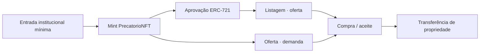

# Modelo da solução

## Objetivo da PoC

Demonstrar um mercado de precatórios tokenizados como NFTs, com os dois lados do livro de ofertas:



A PoC não decide se o precatório é juridicamente válido. Ela assume que a validação institucional aconteceu off-chain e demonstra o registro da propriedade e sua negociação.

## Precatório como NFT

Cada precatório corresponde a um `tokenId` de `PrecatorioNFT`.

Dados específicos armazenados:

```solidity
struct Precatorio {
    bytes32 identifier;
    uint256 faceValue;
    uint256 registeredAt;
}
```

A propriedade é mantida pelo próprio ERC-721.

### Identificador

O frontend recebe um identificador textual, por exemplo:

```text
PREC-2026-001
```

e envia seu `keccak256` ao contrato. A PoC usa o hash apenas como identificador abstrato e para impedir duplicidade; ele não é prova jurídica nem hash de um documento obrigatório.

### Valor de face

`faceValue` usa centavos:

```text
100 = R$ 1,00
100000 = R$ 1.000,00
```

O preço de venda no marketplace é independente do valor de face.

## Marketplace

`PrecatorioMarketplace` tem dois lados: oferta (listagem a preço fixo do vendedor) e demanda (lance de um comprador). Juntos formam o livro de ofertas do mercado secundário exigido pelo projeto.

### Lado da oferta — listagem

```solidity
struct Listing {
    address seller;
    uint256 tokenId;
    uint256 price;
    uint256 createdAt;
    bool active;
}
```

### Listar

Antes da listagem, o proprietário aprova o marketplace:

```text
PrecatorioNFT.approve(marketplace, tokenId)
```

Depois:

```text
PrecatorioMarketplace.list(tokenId, price)
```

O NFT continua na carteira do vendedor até a compra.

### Comprar

`buy(listingId)` recebe exatamente o preço da listagem em ETH de teste.

Na mesma transação:

1. a listagem é encerrada;
2. o NFT é transferido ao comprador;
3. o pagamento de teste é enviado ao vendedor;
4. a venda é registrada por evento.

### Cancelar listagem

Somente o vendedor pode executar `cancel(listingId)` enquanto o marketplace estiver válido e não pausado.

### Lado da demanda — oferta (lance)

```solidity
struct Offer {
    address buyer;
    uint256 tokenId;
    uint256 amount;
    uint256 createdAt;
    bool active;
}
```

Qualquer conta pode propor um lance por um `tokenId` com `makeOffer`, sem depender de uma listagem prévia:

```text
PrecatorioMarketplace.makeOffer(tokenId) { value: lance em ETH de teste }
```

O ETH do lance fica escrowado no próprio contrato até que:

- o proprietário atual do NFT aceite (`acceptOffer`) — transfere o NFT ao comprador, envia o ETH ao vendedor e encerra automaticamente uma eventual listagem a preço fixo ainda ativa para o mesmo `tokenId`; ou
- o comprador cancele (`cancelOffer`) — recupera o próprio depósito.

Cada comprador mantém no máximo uma oferta ativa por `tokenId` (`activeOfferByBuyerAndToken`). A oferta não perde validade se o NFT trocar de proprietário por outro caminho (por exemplo, uma venda por listagem): quem aceita é sempre o proprietário atual no momento do aceite, não quem era proprietário quando o lance foi feito.

`cancelOffer` é a única função mutável do marketplace que funciona mesmo com o contrato pausado ou permanentemente invalidado — decisão deliberada para que ETH de terceiros nunca fique preso dentro do contrato à espera de uma retomada que pode nunca ocorrer.

### Histórico de preços

O frontend não mantém uma tabela de preços on-chain separada; ele reconstitui o histórico consultando os eventos `PrecatorioSold` (venda por listagem) e `OfferAccepted` (venda por oferta aceita) e ordenando por `soldAt`/`acceptedAt`. Isso cobre o requisito de histórico de preços do mercado secundário sem introduzir armazenamento redundante nos contratos.

## Correção monetária e compensação

Além de tokenização e mercado secundário, a PoC demonstra um segundo uso do precatório: quitar um débito fiscal do próprio credor, corrigido monetariamente, em vez de convertê-lo em ETH.

### `MonetaryOracle` — índice de correção mock

Publica um índice acumulado com precisão `1e18` (fator neutro `1,0` no deploy):

```text
valorCorrigido = faceValue × currentIndex / 1e18
```

Só o administrador institucional publica novos índices (`updateIndex`), e o índice nunca regride — reflete uma correção acumulada, não uma cotação de mercado. Na solução real, essa fonte seria um índice oficial (SELIC/IPCA-E); aqui o mesmo administrador da PoC faz esse papel.

### `CompensationManager` — débito fiscal mock e compensação

```solidity
struct FiscalDebt {
    bytes32 identifier;
    address debtor;
    uint256 originalAmount;
    uint256 outstanding;
    uint256 registeredAt;
}
```

O administrador institucional também registra débitos fiscais mock (`registerDebt`), fazendo o papel da Fazenda. `compensate(tokenId, debtId)` só pode ser chamada por uma conta que seja **ao mesmo tempo** a proprietária do precatório e a devedora do débito, e executa em uma única transação indivisível:

1. corrige o valor de face pelo índice vigente do `MonetaryOracle`;
2. abate esse crédito do saldo do débito;
3. queima o precatório (`PrecatorioNFT.burnForCompensation`);
4. grava um termo de quitação permanente e consultável (`compensations`).

Como um ERC-721 não admite consumo parcial, o débito precisa comportar o crédito corrigido inteiro — um débito menor faz a transação reverter (`DebtSmallerThanCredit`), protegendo o credor de perder o valor residual do precatório. Justificativa completa em [`decisoes/oraculo-e-compensacao.md`](./decisoes/oraculo-e-compensacao.md).

## Segurança operacional

### Pausa temporária

Os quatro contratos têm `pause()` e `unpause()` para interrupção temporária.

### Upgrade UUPS

Os quatro contratos são implantados atrás de proxies UUPS. Enquanto válidos, podem receber nova implementação mantendo endereço e estado.

O repositório contém versões `V2` de `PrecatorioNFT` e `PrecatorioMarketplace` apenas para teste/demonstração do mecanismo de upgrade; `MonetaryOracle`/`CompensationManager` não têm uma `V2` de demonstração.

### Invalidação permanente

`invalidate()`:

- marca o contrato como invalidado;
- deixa-o pausado;
- impede retomada;
- impede operações mutáveis de domínio;
- impede transferência de ownership;
- impede novos upgrades.

Além disso, `renounceOwnership()` é desabilitado mesmo enquanto o contrato está válido, para evitar que a PoC perca a única conta capaz de pausar, atualizar ou invalidar o proxy.

A blockchain continua permitindo consultas históricas; “invalidado” significa sem validade operacional, não remoção física do bytecode.

A justificativa técnica e as referências estão em [`decisoes/revisao-escopo-nft.md`](./decisoes/revisao-escopo-nft.md).

## Perfis da PoC

### Administrador institucional

Conta configurada no deploy:

- emite precatórios;
- publica o índice de correção monetária (`MonetaryOracle`);
- registra débitos fiscais mock, no papel da Fazenda (`CompensationManager`);
- pausa/retoma contratos;
- autoriza upgrades;
- pode invalidar permanentemente os contratos.

### Titular/vendedor

- possui o NFT;
- aprova o marketplace;
- cria e cancela sua listagem;
- pode aceitar uma oferta recebida em vez de esperar uma listagem vender.

### Comprador

- consulta listagens e envia ofertas, com ou sem listagem ativa;
- compra um NFT com ETH de teste (listagem) ou tem uma oferta aceita pelo proprietário;
- pode cancelar sua própria oferta e recuperar o depósito em qualquer momento, mesmo com o marketplace pausado ou invalidado;
- torna-se novo proprietário on-chain.

### Credor/devedor (compensação)

Qualquer conta que seja simultaneamente proprietária de um precatório **e** devedora de um débito fiscal mock registrado pelo administrador:

- consulta o valor de face corrigido pelo índice vigente antes de decidir;
- executa `compensate`, extinguindo o precatório e abatendo o débito na mesma transação;
- não recebe ETH nessa operação — a "liquidação" é o abatimento do próprio débito, não uma venda.

## Limitações

- não há validação jurídica real;
- não há documentos processuais na blockchain;
- não há integração com TJPB, Fazenda ou sistemas externos;
- ETH local (ou de testnet pública) é apenas mock de liquidação;
- o índice de correção monetária e os débitos fiscais são mocks operados pelo mesmo administrador institucional, sem fonte externa (SELIC/IPCA-E) nem integração real com a Fazenda;
- não há identidade institucional de produção ou multisig;
- não há indexador persistente off-chain; o frontend descobre ativos, listagens, ofertas, débitos e compensações por eventos desde o bloco de deploy e consulta o estado atual diretamente no RPC;
- uma listagem pode permanecer `active` on-chain após transferência externa ou revogação de aprovação; o frontend detecta esse estado, marca a listagem como indisponível e permite ao vendedor cancelá-la. O mesmo vale para uma oferta cujo proprietário atual ainda não aprovou o marketplace: ela aparece como "aguardando aprovação" até que isso mude;
- não há execução parcial nem em listagens, ofertas ou compensações: cada uma cobre o NFT completo;
- a PoC não substitui auditoria de segurança.
